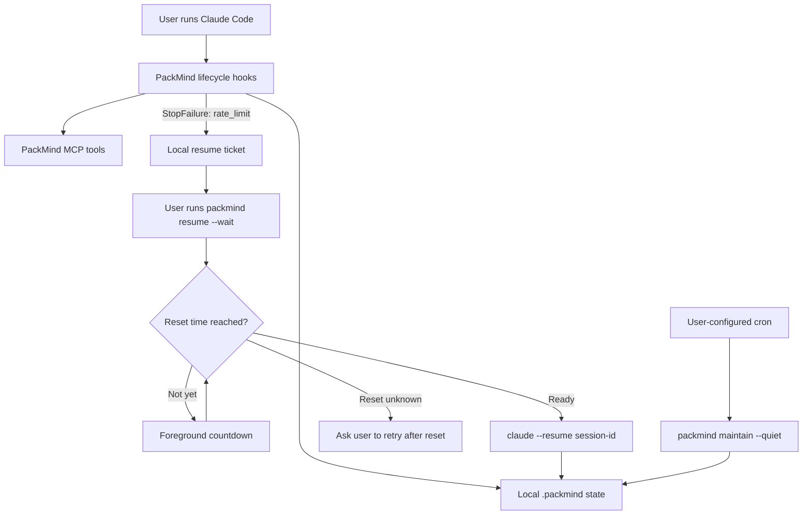

<p align="center">
  
</p>

<h1 align="center">PackMind</h1>

<p align="center">
  <strong>A local second brain for Claude Code.</strong><br />
  PackMind preserves project memory across Claude Code sessions, helps avoid repeated reads, and safely resumes a rate-limited session when the user asks it to.
</p>

<p align="center">
  <a href="https://github.com/mchl-schrdng/packmind/actions/workflows/ci.yml"></a>
  <a href="badges/coverage.svg"></a>
  <a href="https://github.com/mchl-schrdng/packmind/actions/workflows/codeql.yml"></a>
  <a href="https://www.npmjs.com/package/packmind"></a>
  <a href="LICENSE"></a>
  
</p>

---

## The problem it solves

Claude Code starts every session from scratch: it re-reads files it has already seen, forgets decisions, and when you hit a usage limit the session is stranded until you piece things back together by hand. PackMind keeps a per-project `.packmind/` state (map, journal, knowledge, usage ledger) maintained by lifecycle hooks, exposes it back to Claude through MCP tools, and records exactly which session was rate-limited so you can resume it - explicitly, safely, once.

## Install in five minutes

```bash
npm install -g packmind   # or: pnpm add -g packmind
cd your-project
packmind init             # creates .packmind/, registers hooks + the MCP server
claude                    # use Claude Code as normal
```

`packmind init` writes lifecycle hooks into `.claude/settings.json` (tagged `_managedBy: "packmind"`; your own settings are preserved and backed up once to `settings.json.packmind-bak`) and registers the `packmind` MCP server in `.mcp.json`.

## How it works



What this diagram guarantees:

- Resuming requires an **explicit user action** (`packmind resume`); nothing is relaunched automatically.
- PackMind **does not bypass Claude usage limits** - it only waits for the reset and then resumes the exact session.
- The cron job only maintains **local data**; it **never launches Claude** and never consumes Claude tokens.
- **No PackMind daemon** runs in the background - everything is short-lived hooks and one-shot commands.

## Resuming after a rate limit

When a session ends on a `rate_limit` API error, Claude Code fires the `StopFailure` hook. PackMind records a small local ticket (`.packmind/state/resume-tickets/<session-id-hash>.json`) with the session id, a `blocked` status, and the reset time when it is clearly known. The ticket never contains messages, transcripts, secrets, or source content.

```bash
packmind resume                # resume the only blocked session
packmind resume --session <id> # pick one when several are blocked
packmind resume --wait         # foreground countdown, launch at reset time
```

Behavior:

- Reset already passed → launches `claude --resume <session-id>` immediately.
- Reset in the future without `--wait` → prints the reset time and launches nothing.
- Reset in the future with `--wait` → visible countdown, then a single launch. Ctrl-C aborts without launching; the ticket is kept.
- Reset unknown with `--wait` → nothing is launched; retry after the limit resets.
- Reset unknown without `--wait` → warns, then launches, because you asked explicitly.
- Close the previous Claude process first - PackMind refuses concurrent resumes of the same session and launches exactly once.

## CLI commands

| Command | What it does |
|---|---|
| `packmind init` | Set up `.packmind/`, hooks, and the MCP server in a project |
| `packmind resume [--session <id>] [--wait]` | Resume a rate-limited Claude session |
| `packmind maintain [--quiet] [--keep-backups <n>]` | One-shot local upkeep, safe under cron |
| `packmind status` | Token usage, cost, and project health |
| `packmind scan` | Rebuild the project map |
| `packmind recall <query>` | Search project memory semantically |
| `packmind backup` / `packmind restore` | Snapshot / restore `.packmind/` |
| `packmind doctor [--fix]` | Diagnose the installation; `--fix` removes a maintain lock older than 6h |

Run `packmind --help` for the full list (insights, index, solutions, policy, practice, dashboard, update, upgrade…).

## MCP tools

The `packmind` MCP server (registered in `.mcp.json` by init, started automatically by Claude Code) exposes the brain to Claude:

- `recall` - semantic search over project memory
- `remember` / `record_solution` / `record_evidence` - capture decisions, fixes, and practice evidence
- `project_map` - the token-priced file map, so Claude checks before re-reading
- `insights` / `usage_report` - where tokens go and what PackMind saved
- `handoff` - get/set the "where we left off" note between sessions
- `compress` / `retrieve` - shelve and recover non-source blobs by hash
- `changes` / `review` / `debt` - the session's net change set, review summary, deferred-shortcut ledger

## Maintenance via cron

PackMind installs no scheduler: **it never creates, modifies, or deletes your crontab**. If you want unattended upkeep, add a line yourself:

```cron
# Tous les jours à 02:00
0 2 * * * cd /chemin/absolu/projet && /chemin/absolu/packmind maintain --quiet >> /chemin/absolu/packmind-maintain.log 2>&1
```

`packmind maintain --keep-backups <n>` accepts an integer from 1 to 1000 (default 10) and validates it before touching anything. Each run takes an exclusive lock (`.packmind/state/maintain.lock/` - a second concurrent run exits with code 3, and the lock is never stolen), then in order: reconciles active sessions, refreshes the map, processes the recall queue incrementally, archives an overgrown journal, deletes only genuinely finalized sessions (active and suspended sessions are never removed by age), and finally prunes backups - skipped entirely if any earlier step failed. `--quiet` hides successes, never errors (errors go to stderr).

Exit codes: `0` success · `1` invalid arguments/config · `2` partial failure · `3` another maintenance is active.

## Local data & privacy

Everything lives in `.packmind/` inside your project (plus `~/.packmind` for backups and the project registry). Nothing is sent anywhere: no telemetry, no network calls except the optional local-embedding model download for recall (and the opt-in `packmind scan --exact` token reconciliation). Resume tickets contain lifecycle metadata only - never API messages, transcripts, secrets, or source content. `.packmind/` belongs in `.gitignore`.

## Known limitations

- Resume relies on Claude Code's `StopFailure` hook payload; when it carries no reset time, PackMind never guesses one - `--wait` will ask you to retry instead.
- One resume ticket per session id; tickets are confirmed and dropped when the session actually starts again.
- Token/cost figures are estimates unless reconciled with `packmind scan --exact`.
- Semantic recall needs the optional `@xenova/transformers` dependency; without it, recall steps are skipped.

## Uninstall

```bash
packmind doctor        # see what is registered where
```

Remove the `_managedBy: "packmind"` hook groups from `.claude/settings.json` (or restore `settings.json.packmind-bak`), remove the `packmind` entry from `.mcp.json`, delete `.packmind/` in the project and `~/.packmind` globally, then `npm uninstall -g packmind`.

## License

Apache-2.0.
