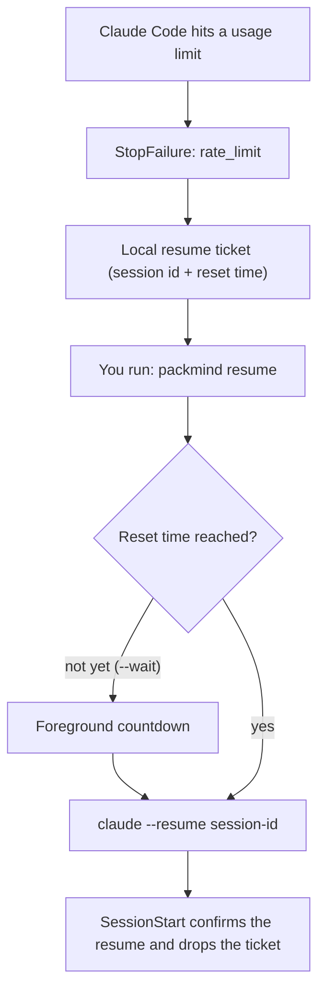

<p align="center">
  
</p>

<h1 align="center">PackMind</h1>

<p align="center">
  <strong>PackMind resumes your rate-limited Claude Code session and gives your team a committed project memory Claude reads automatically.</strong>
</p>

<p align="center">
  <a href="https://github.com/mchl-schrdng/packmind/actions/workflows/ci.yml"></a>
  <a href="https://github.com/mchl-schrdng/packmind/actions/workflows/codeql.yml"></a>
  <a href="https://www.npmjs.com/package/packmind"></a>
  <a href="LICENSE"></a>
  
</p>

---

## Why PackMind

Two things go missing when a team works with Claude Code every day.

First, sessions die at the worst moment. When a usage limit cuts a session off,
that exact conversation is stranded: you wait out the reset, then piece the
context back together by hand. PackMind records a local resume ticket the
instant the limit hits and relaunches the exact session, once, when you ask.

Second, what Claude learns evaporates. Fixes, decisions, and "never do this
again" lessons live and die inside one developer's session. PackMind keeps them
in a handful of plain-text files inside your repo. They are committed, diffable,
and reviewed like code, so the whole team (and every future session) starts
with the same memory. Claude reads them automatically at session start and
whenever a prompt matches a problem it has already solved.

That is the whole product. Four lifecycle hooks, four MCP tools, six CLI
commands, no daemon, no telemetry, no heavy dependencies, no postinstall
scripts. Everything stays on your machine and in your git history.

## Install

```bash
npm install -g packmind
cd your-project
packmind init
```

`packmind init` creates `.packmind/` (the brain files), registers the four
hooks in `.claude/settings.json` (your original file is backed up once as
`settings.json.packmind-bak`), and registers the MCP server in `.mcp.json`
using `npx packmind mcp`, so it works for both global and project-local
installs. Then use `claude` as normal.

Commit `.packmind/` so your team shares the memory:

```bash
git add .packmind .mcp.json && git commit -m "chore: add project memory"
```

After upgrading the package (`npm update -g packmind`), run `packmind update`
to refresh the hook scripts in every registered project.

## Resuming a rate-limited session

When Claude Code stops with a rate-limit failure, the `stop-failure` hook
writes a local ticket that captures the session id and the documented reset
time. Nothing is launched automatically: resuming is always an explicit user
action.



```bash
packmind resume            # relaunch the interrupted session (errors if the limit is still active)
packmind resume --wait     # wait for the reset in the foreground, then relaunch
packmind resume --session <id>   # pick a session when several tickets exist
```

Guarantees:

- Resume happens only on explicit user action. PackMind never launches Claude
  on its own and runs no daemon.
- It does not bypass usage limits. It waits for the documented reset, then
  continues the exact session with `claude --resume <session-id>`.
- The ticket lifecycle is crash-safe: a launch that dies is recovered by
  `packmind doctor --fix`, and duplicate resumes of the same ticket are locked
  out.

## Team memory

The brain files live in `.packmind/` and are meant to be committed:

| File | What it holds |
|------|---------------|
| `knowledge.md` | Durable project lessons, including a Never-Do list surfaced to Claude at session start |
| `solutions.json` | Error-to-fix pairs recorded when something gets solved, resurfaced when a prompt matches a past error |
| `handoff.md` | Where the last session left off, injected at the start of the next one |
| `policy.json` | Your guard rules (see Guardrails) |
| `config.json` | PackMind settings for this project |

Claude maintains the memory through the MCP tools:

| Tool | Purpose |
|------|---------|
| `recall` | Search the brain files by keyword and get ranked snippets |
| `remember` | Append a durable lesson to `knowledge.md` |
| `record_solution` | Record an error and its fix in `solutions.json` |
| `handoff` | Read or set the session handoff note |

Recall is a fast lexical search over the brain files. There is no embedding
model to download, no index to maintain, and nothing leaves your machine.

## Guardrails

Before Claude writes a file, the `pre-write` hook checks the path and content
against the guard rules. The built-in rule stops writes to secret-shaped files
(`.env`, key material, credential stores) with a warning, and PackMind never
indexes or stores the content of such files.

Rules live in `.packmind/policy.json` and are resolved by id: a local rule with
the same id as a built-in overrides it, so turning the secret rule into a hard
block is one edit:

```json
{ "rules": [{ "id": "no-secret-files", "severity": "block" }] }
```

## CLI commands

| Command | What it does |
|---------|--------------|
| `packmind init` | Set up `.packmind/`, hooks, and the MCP server in a project |
| `packmind status` | Show brain files, hook registration, and any pending resume ticket |
| `packmind doctor` | Health check; `--fix` repairs recoverable states (orphaned launches, stale locks) |
| `packmind update` | Refresh installed hook scripts after a package upgrade |
| `packmind resume` | Relaunch the rate-limited session recorded in the local ticket |
| `packmind mcp` | Run the MCP stdio server (registered by init; not usually run by hand) |

## What lives in `.packmind/`

Everything is plain text or JSON, local, and yours. The durable brain files
listed above are meant to be committed. Runtime state (resume tickets, locks)
stays out of version control via the `.gitignore` that init writes. Deleting
`.packmind/` deletes everything PackMind knows.

## Security and privacy

- No network calls. Hooks and MCP tools operate on local files only.
- Hooks are dependency-free Node scripts copied into your project; you can read
  every line of what runs on your lifecycle events.
- Secret-shaped files are never read, indexed, or stored.
- Treat brain files as data, not instructions: they are injected into Claude's
  context, so review changes to `.packmind/` in pull requests the same way you
  review code. A hostile edit to a committed memory file is a prompt-injection
  vector, which is exactly why the files are diffable and reviewable.

## Limits

- The resume flow depends on the `StopFailure` hook event; it requires a recent
  Claude Code version. On older versions the ticket is simply never created.
- `recall` is lexical, not semantic: it matches words, not meaning. Memory is
  only as good as what gets recorded, and recording is Claude-driven.
- PackMind tracks one pending resume ticket per session; tickets for sessions
  you never resume are cleaned up by `packmind doctor --fix`.

## Uninstall

```bash
npm uninstall -g packmind
```

Then, in each project: remove the PackMind-managed groups from
`.claude/settings.json` (or restore `settings.json.packmind-bak`), remove the
`packmind` entry from `.mcp.json`, and delete `.packmind/` plus the PackMind
block in `CLAUDE.md`. Nothing else is touched.

## Contributing

Issues and pull requests are welcome. See [CONTRIBUTING.md](CONTRIBUTING.md).
Run `pnpm build` and `pnpm test` before submitting; both must be green.

## License

[Apache-2.0](LICENSE)
