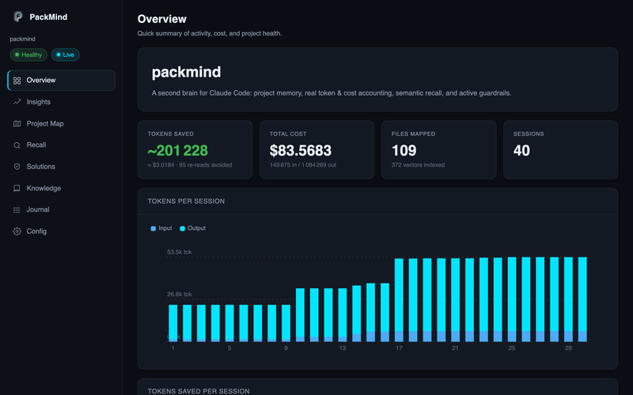

<p align="center">
  
</p>

<h1 align="center">PackMind</h1>

<p align="center">
  <strong>A second brain for Claude Code.</strong><br />
  Project memory, real token &amp; cost accounting, local semantic recall, and active guardrails - through lifecycle hooks and an MCP server. Zero workflow changes.
</p>

<p align="center">
  <a href="https://github.com/mchl-schrdng/packmind/actions/workflows/ci.yml"></a>
  <a href="badges/coverage.svg"></a>
  <a href="https://github.com/mchl-schrdng/packmind/actions/workflows/codeql.yml"></a>
  <a href="https://www.npmjs.com/package/packmind"></a>
  <a href="LICENSE"></a>
  
</p>

---

<p align="center">
  
</p>

---

## What PackMind does

Claude Code works without persistent project context: it can't tell a 50-token
config from a 2,000-token module before opening it, re-reads the same files, and
forgets what it learned last session. PackMind fixes that with a small state
directory (`.packmind/`) maintained by lifecycle hooks, plus an MCP server that
exposes the project's memory as tools Claude can query directly.

- **Project map** - every file gets a one-line description, a token estimate, and
  an estimated read cost, so Claude reads `map.md` instead of opening files blind.
- **Real token &amp; cost accounting** - fast local estimates always, priced per
  model into a running **dollar total**. Exact reconciliation via Anthropic's
  count-tokens API is **opt-in** (`packmind scan --exact`), so nothing leaves your
  machine by default.
- **Local semantic recall** - an on-device embedding index (nothing leaves your
  machine) lets Claude `recall(...)` past decisions, solutions, and code by meaning.
- **Active guardrails** - a policy engine warns (or hard-blocks, opt-in) before a
  write touches a secret file or violates a project rule.
- **Practice packs** - installable sets of engineering reflexes (tests, CI, release
  hygiene, security) that nudge at the right moment. Session-level checks like
  "`src/**` changed but no test written" can be satisfied with the `record_evidence`
  tool so they stay quiet once you've done the thing. Manage with `packmind practice`.
- **Lean mode**: a reuse-first decision ladder that nudges Claude to build less
  (`off` / `lite` / `full`), with a `packmind:` shortcut convention you harvest via `debt`.
- **Reversible compression** - shelve a large non-source output (log, JSON, command dump)
  with `compress(...)` and pull the exact original back with `retrieve(hash)`, to keep the
  session's context lean.

## Quick start

```bash
npm install -g packmind     # or: pnpm add -g packmind
cd your-project
packmind init               # sets up .packmind/, hooks, and the MCP server
packmind index              # builds the local semantic index (first run fetches the embed model)
```

Then use `claude` as normal.

## The MCP tools

Registered automatically in `.mcp.json`. Claude can call:

| Tool | Purpose |
|------|---------|
| `recall(query)` | Semantic search across knowledge, journal, solutions, and source |
| `remember(note, kind)` | Save a preference, decision, never-do rule, or note |
| `record_solution(error, cause, fix, tags)` | Log a fix so it's never rediscovered |
| `record_evidence(check, detail?)` | Mark a practice check satisfied this session so its nudge stays quiet |
| `project_map(filter?)` | List files with descriptions and token estimates |
| `usage_report()` | Token usage and dollar cost for the project |
| `insights()` | Savings, map coverage, heaviest files, and upkeep notes |
| `handoff(action, content?)` | Read or update the session resume note |
| `debt()` | List `packmind:` deferred-shortcut markers left in the code |
| `review(base?)` | Package the current diff with the lean ladder for an over-engineering review |
| `compress(content, kind?)` | Shelve a large non-source output, get a compact reversible preview + hash |
| `retrieve(hash)` | Return the full original a `compress` call stored |

## CLI

```
packmind init             Set up .packmind/, hooks, and the MCP server
packmind scan [--check]   Rebuild the project map (--check exits 1 if stale; content-aware)
packmind scan --exact     Reconcile token counts via Anthropic count-tokens (needs ANTHROPIC_API_KEY)
packmind index            Build the local semantic recall index
packmind recall <query>   Search project memory from the terminal
packmind solutions <term> Search recorded fixes
packmind debt             List packmind: deferred-shortcut markers (lean debt ledger)
packmind status           Token usage, dollar cost, and health
packmind insights         Where tokens go and what PackMind saved
packmind dashboard        Open the local web dashboard (loopback, token-protected)
packmind maintain         One-shot upkeep: scan + reindex + archive + prune (cron-friendly)
packmind backup [--list]  Snapshot .packmind/ to ~/.packmind/backups
packmind restore [stamp]  Restore .packmind/ from a backup (omit to list)
packmind policy check     Lint guardrail rules
packmind practice list    List bundled practice packs and which are active
packmind practice add|remove <pack>   Activate/deactivate a practice pack
packmind practice explain <path>      Show which rules/checks apply to a path
packmind doctor           Diagnose projects, hooks, and MCP registration
packmind update           Update registered projects (snapshots first, preserves config.json)
packmind mcp              Run the MCP server (used by Claude Code)
```

## What lives in `.packmind/`

| File | Role | Commit? |
|------|------|---------|
| `map.md` | File map with tokens &amp; cost | yes |
| `knowledge.md` | Preferences, decisions, never-do list | yes |
| `identity.md` | Persistent project identity notes | yes |
| `config.json` | Configuration | yes |
| `policy.json` | Guardrail rules (your local overrides) | yes |
| `PACKMIND.md` | Protocol Claude follows | yes |
| `guard.effective.json` | Resolved guard set (default + packs + policy.json) | no (derived) |
| `journal.md` | Action log + session summaries | optional |
| `solutions.json` | Recorded fixes | optional |
| `usage.json` | Token &amp; cost ledger | no (per-dev) |
| `handoff.md` | Session resume note | no (per-dev) |
| `compress/` | Reversible shelved-output store | no (per-dev) |
| `recall/` | Local vector index | no (per-dev) |

## Scheduled maintenance (no daemon)

Instead of a background daemon, PackMind ships a single `maintain` command you
schedule yourself - it refreshes the map, rebuilds the recall index, archives an
overgrown journal, and prunes old backups. Wire it into your own scheduler:

```cron
# crontab -e  - keep a project's brain fresh every night at 2am
0 2 * * * cd /path/to/project && packmind maintain --quiet
```

No persistent process, no open ports, no state to leak.

## Configuration

`.packmind/config.json` is deep-merged over defaults, so it survives `packmind
update` and stays forward-compatible. Notable keys:

- `model` - drives cost pricing (`claude-opus-4-8` by default).
- `cost.exact` - when `scan` reconciles to exact counts: `never` (default, no
  network) | `auto` (exact when `ANTHROPIC_API_KEY` is set) | `always`. You can
  always force it per-run with `packmind scan --exact`. Hooks always use the fast
  local estimate.
- `cost.prices` - override the built-in (approximate) per-model rates, e.g.
  `{ "claude-opus-4-8": { "inputPerMTok": 5, "outputPerMTok": 25 } }`. The
  defaults are best-effort; set this to your account's actual pricing.
- `recall.enabled` / `recall.embedModel` - local embeddings; fully offline.
- `guard.blockSecrets` - set `true` to hard-block writes to secret files.
- `guard.practices` - active practice packs (e.g. `quality-core`,
  `release-manager`), managed with `packmind practice add|remove|list|explain`.
- `guard.lean.mode` sets the reuse-first nudge before writes: `off` | `lite` | `full` (default `lite`).
- `map.respectGitignore`, `map.extraSecretGlobs` - control what gets mapped.

## Privacy

Embeddings run locally via an on-device model cached under `~/.packmind/models`;
your code is never sent anywhere for recall. The only optional network call is
Anthropic's count-tokens endpoint, off by default and used only when you opt into
exact counting (`cost.exact` other than `never`, or `packmind scan --exact`).

## Security

- **Dependency CVEs** are scanned on every CI run (`pnpm audit`): the build gates
  on the core/shipped tree at `--audit-level=high`; a full-tree audit runs as
  informational.
- **Core dependencies carry no known high/critical advisories.** The only source
  of transitive advisories is the **optional** local-recall dependency
  (`@xenova/transformers`), which bundles an older ML runtime. It is never
  required - install without it (`npm install packmind --omit=optional`) for a
  CVE-clean tree, or set `recall.enabled: false`. Migrating recall to the
  maintained `@huggingface/transformers` is tracked future work.
- **Code scanning** via CodeQL runs when the repository is public (or has GitHub
  Advanced Security); the workflow is skipped, not failed, otherwise.
- Found something? See [the repo issues](https://github.com/mchl-schrdng/packmind/issues).

## Requirements

- Node.js 20+
- Claude Code

## License

[Apache-2.0](LICENSE).
