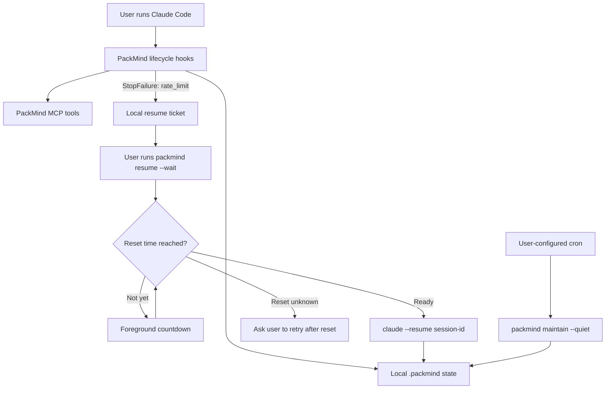

# PackMind 1.0.0 Minimal Implementation Plan

> **For agentic workers:** REQUIRED SUB-SKILL: Use superpowers:subagent-driven-development (recommended) or superpowers:executing-plans to implement this plan task-by-task. Steps use checkbox (`- [ ]`) syntax for tracking.

**Goal:** Ship PackMind 1.0.0 with exactly three additions: resume a rate-limited Claude Code session on explicit user request, make `packmind maintain` safe under cron, and rewrite the README with a Mermaid diagram documenting both.

**Architecture:** A new zero-dependency `StopFailure` hook (matcher `rate_limit`) writes a local resume ticket under `.packmind/state/resume-tickets/`; a new `packmind resume` CLI command consumes tickets with an atomic blocked→launching transition and spawns `claude --resume <id>` once, foreground; `SessionStart` clears the ticket when the session actually comes back. `maintain` gains strict pre-mutation validation, an exclusive `maintain.lock/` directory, a fixed step order with failure tracking, and exit codes 0/1/2/3.

**Tech Stack:** Node ≥20, TypeScript ESM (NodeNext, `.js` import specifiers), hooks compiled separately to CommonJS via `tsconfig.hooks.json`, commander CLI, Vitest, pnpm. No new dependencies.

## Global Constraints

- Scope is ONLY: resume-after-rate-limit, cron-safe maintain, README rewrite. Nothing from §6 hors-scope (no Impact Intelligence, no dependency graph, no state migration v2, no new MCP tools, no scheduler installation, no daemon, no invisible retry, no `--dry-run`/`--full`/`--json` on maintain, no 80% coverage goal).
- Base branch: `release/v1-minimal` off `main` (v0.9.2). `feat/v1` is NOT merged; cherry-pick only if directly needed (none identified).
- **Hooks are zero-dependency**: files under `src/hooks/` import ONLY Node builtins (and `./runtime.js`).
- **NodeNext imports**: `import { x } from "./foo.js"` resolving to `.ts` sources.
- **Hermetic tests**: never touch real `~/.packmind` (`test/setup.ts` sets `PACKMIND_HOME`); per-test project roots via `fs.mkdtempSync` + `PACKMIND_ROOT`.
- The StopFailure hook only records state — it never launches, retries, or works around a limit. `packmind resume` never bypasses limits; it launches `claude --resume <session-id>` with an argument array (never a concatenated shell string), from the validated project root, with inherited stdio, exactly once.
- Tickets never contain raw API messages, secrets, source content, or transcripts.
- `maintain` never launches Claude and never consumes Claude tokens. It installs no cron.
- `--quiet` hides successes, never errors; errors go to stderr. Maintain exit codes: 0 success, 1 invalid config/arguments, 2 partial failure, 3 another maintenance active.
- Commit messages: no AI/co-author trailers. `pnpm build` + `pnpm test` green before every commit. No `git push` without Michael's explicit go.
- Docs verified 2026-07-13 (https://code.claude.com/docs/en/hooks): `StopFailure` fires "when the turn ends due to an API error", output and exit code ignored, matcher filters on error type with exact value `rate_limit`; common input fields include `session_id`, `transcript_path`, `cwd`, `hook_event_name`. **No reset-time field is documented** — resetAt extraction must be defensive and never invented.

---

### Task 1: Resume ticket store (`src/state/resume.ts`)

**Files:**
- Create: `src/state/resume.ts`
- Test: `test/resume-tickets.test.ts`

**Interfaces:**
- Consumes: `updateJson`, `readJsonOr` from `src/util/fs-atomic.ts`; `stateFile` from `src/util/paths.ts`.
- Produces (used by Tasks 3, 4, 6, 8):
  - `interface ResumeTicketV1 { version: 1; sessionId: string; status: "blocked" | "launching" | "resumed"; createdAt: string; updatedAt: string; resetAt?: string; reconcileRequested: boolean }`
  - `ticketFile(root: string, sessionId: string): string`
  - `ticketsDir(root: string): string`
  - `listTickets(root: string): Array<{ file: string; ticket: ResumeTicketV1 }>`
  - `readTicket(root: string, sessionId: string): ResumeTicketV1 | null`
  - `blockTicket(root: string, sessionId: string, now: string, resetAt?: string): void`
  - `tryAcquireLaunch(root: string, sessionId: string, now: string): boolean`
  - `releaseLaunch(root: string, sessionId: string, now: string): void`
  - `removeTicket(root: string, sessionId: string): void`

- [ ] **Step 1: Write the failing test**

```typescript
// test/resume-tickets.test.ts
import { describe, it, expect } from "vitest";
import * as os from "node:os";
import * as fs from "node:fs";
import * as path from "node:path";
import {
  ticketFile,
  listTickets,
  readTicket,
  blockTicket,
  tryAcquireLaunch,
  releaseLaunch,
  removeTicket,
} from "../src/state/resume.js";

function tmpRoot(): string {
  return fs.mkdtempSync(path.join(os.tmpdir(), "pm-resume-"));
}
const NOW = "2026-07-13T10:00:00.000Z";

describe("resume ticket store", () => {
  it("ticketFile hashes the session id (sha256, 16 hex) under state/resume-tickets", () => {
    const root = tmpRoot();
    const f = ticketFile(root, "abc123");
    expect(f).toContain(path.join(".packmind", "state", "resume-tickets"));
    expect(path.basename(f)).toMatch(/^[0-9a-f]{16}\.json$/);
    // injective: different ids, different files
    expect(ticketFile(root, "other")).not.toBe(f);
  });

  it("blockTicket creates a v1 blocked ticket with the exact session id", () => {
    const root = tmpRoot();
    blockTicket(root, "abc123", NOW);
    const t = readTicket(root, "abc123")!;
    expect(t).toMatchObject({
      version: 1,
      sessionId: "abc123",
      status: "blocked",
      createdAt: NOW,
      updatedAt: NOW,
      reconcileRequested: true,
    });
    expect(t.resetAt).toBeUndefined(); // never invented
  });

  it("blockTicket keeps createdAt and re-blocks an existing ticket (new rate limit)", () => {
    const root = tmpRoot();
    blockTicket(root, "abc123", NOW, "2026-07-13T11:00:00.000Z");
    expect(tryAcquireLaunch(root, "abc123", NOW)).toBe(true);
    expect(readTicket(root, "abc123")!.status).toBe("launching");
    const later = "2026-07-13T10:30:00.000Z";
    blockTicket(root, "abc123", later);
    const t = readTicket(root, "abc123")!;
    expect(t.status).toBe("blocked");
    expect(t.createdAt).toBe(NOW);
    expect(t.updatedAt).toBe(later);
    expect(t.resetAt).toBe("2026-07-13T11:00:00.000Z"); // prior reset kept when new one unknown
  });

  it("tryAcquireLaunch succeeds once; a concurrent second call is refused", () => {
    const root = tmpRoot();
    blockTicket(root, "abc123", NOW);
    expect(tryAcquireLaunch(root, "abc123", NOW)).toBe(true);
    expect(tryAcquireLaunch(root, "abc123", NOW)).toBe(false);
    releaseLaunch(root, "abc123", NOW);
    expect(readTicket(root, "abc123")!.status).toBe("blocked");
    expect(tryAcquireLaunch(root, "abc123", NOW)).toBe(true);
  });

  it("tryAcquireLaunch on a missing ticket is refused", () => {
    expect(tryAcquireLaunch(tmpRoot(), "ghost", NOW)).toBe(false);
  });

  it("listTickets returns every parseable ticket; removeTicket deletes", () => {
    const root = tmpRoot();
    blockTicket(root, "a", NOW);
    blockTicket(root, "b", NOW);
    expect(listTickets(root).map((e) => e.ticket.sessionId).sort()).toEqual(["a", "b"]);
    removeTicket(root, "a");
    expect(listTickets(root).map((e) => e.ticket.sessionId)).toEqual(["b"]);
    expect(listTickets(tmpRoot())).toEqual([]); // no dir -> empty
  });
});
```

- [ ] **Step 2: Run test to verify it fails**

Run: `pnpm vitest run test/resume-tickets.test.ts`
Expected: FAIL — `Cannot find module '../src/state/resume.js'`

- [ ] **Step 3: Write the implementation**

```typescript
// src/state/resume.ts
import * as fs from "node:fs";
import * as path from "node:path";
import * as crypto from "node:crypto";
import { stateFile } from "../util/paths.js";
import { readJsonOr, updateJson } from "../util/fs-atomic.js";

/**
 * Local resume tickets: one small JSON file per rate-limited Claude session,
 * written by the StopFailure hook and consumed by `packmind resume`. Tickets
 * hold ONLY lifecycle metadata (never API messages, secrets, source content,
 * or transcripts). The file name is a hash of the raw session_id, mirroring
 * the session-file naming (injective, path-safe).
 */
export interface ResumeTicketV1 {
  version: 1;
  sessionId: string;
  status: "blocked" | "launching" | "resumed";
  createdAt: string;
  updatedAt: string;
  resetAt?: string;
  reconcileRequested: boolean;
}

export function ticketsDir(root: string): string {
  return stateFile(root, "state", "resume-tickets");
}

export function ticketFile(root: string, sessionId: string): string {
  const hash = crypto.createHash("sha256").update(sessionId).digest("hex").slice(0, 16);
  return path.join(ticketsDir(root), `${hash}.json`);
}

export function readTicket(root: string, sessionId: string): ResumeTicketV1 | null {
  return readJsonOr<ResumeTicketV1 | null>(ticketFile(root, sessionId), null);
}

export function listTickets(root: string): Array<{ file: string; ticket: ResumeTicketV1 }> {
  let names: string[];
  try {
    names = fs.readdirSync(ticketsDir(root)).filter((n) => n.endsWith(".json"));
  } catch {
    return [];
  }
  const out: Array<{ file: string; ticket: ResumeTicketV1 }> = [];
  for (const n of names) {
    const file = path.join(ticketsDir(root), n);
    const t = readJsonOr<ResumeTicketV1 | null>(file, null);
    if (t && t.version === 1 && typeof t.sessionId === "string") out.push({ file, ticket: t });
  }
  return out;
}

/** Create-or-reset a ticket to blocked. A resetAt is only ever recorded when
 * the caller clearly extracted one; a prior known resetAt survives a re-block. */
export function blockTicket(root: string, sessionId: string, now: string, resetAt?: string): void {
  updateJson<ResumeTicketV1 | null>(ticketFile(root, sessionId), null, (prev) => {
    const kept = resetAt ?? prev?.resetAt;
    return {
      version: 1,
      sessionId,
      status: "blocked",
      createdAt: prev?.createdAt ?? now,
      updatedAt: now,
      ...(kept ? { resetAt: kept } : {}),
      reconcileRequested: true,
    };
  });
}

/** Atomic blocked -> launching transition (read+write under one file lock).
 * Returns false when the ticket is absent or not blocked, so a second
 * concurrent `packmind resume` is refused instead of double-launching. */
export function tryAcquireLaunch(root: string, sessionId: string, now: string): boolean {
  let acquired = false;
  updateJson<ResumeTicketV1 | null>(ticketFile(root, sessionId), null, (t) => {
    if (t && t.status === "blocked") {
      acquired = true;
      return { ...t, status: "launching", updatedAt: now };
    }
    return t;
  });
  if (!acquired) {
    // updateJson may have materialized a null file for a missing ticket; drop it.
    const t = readJsonOr<ResumeTicketV1 | null>(ticketFile(root, sessionId), null);
    if (!t) removeTicket(root, sessionId);
  }
  return acquired;
}

/** Roll a failed launch back to blocked so the ticket stays recoverable. */
export function releaseLaunch(root: string, sessionId: string, now: string): void {
  updateJson<ResumeTicketV1 | null>(ticketFile(root, sessionId), null, (t) =>
    t ? { ...t, status: "blocked", updatedAt: now } : t,
  );
}

export function removeTicket(root: string, sessionId: string): void {
  try {
    fs.rmSync(ticketFile(root, sessionId), { force: true });
  } catch {
    /* best effort */
  }
}
```

- [ ] **Step 4: Run test to verify it passes**

Run: `pnpm vitest run test/resume-tickets.test.ts`
Expected: PASS (6 tests)

Note: if the `tryAcquireLaunch` missing-ticket test fails because `updateJson` wrote a `null` JSON file, the guard in the implementation removes it; verify `listTickets` stays empty in that test.

- [ ] **Step 5: Commit**

```bash
git add src/state/resume.ts test/resume-tickets.test.ts
git commit -m "feat: resume ticket store (blocked/launching lifecycle, hashed per-session files)"
```

---

### Task 2: StopFailure hook (`src/hooks/stop-failure.ts` + runtime additions)

**Files:**
- Modify: `src/hooks/runtime.ts` (append after the session helpers, around line 660)
- Create: `src/hooks/stop-failure.ts`
- Test: `test/resume-hook.test.ts`

**Interfaces:**
- Consumes: `requireState`, `brainPath`, `parseInput`, `readStdin`, `updateJson`, `readJson` from `src/hooks/runtime.ts`.
- Produces (used by Tasks 3, 8):
  - In `runtime.ts`: `extractResetAt(input: Record<string, any>, nowMs: number): string | undefined`, `resumeTicketFile(sessionId: string): string`, `blockResumeTicket(sessionId: string, now: string, resetAt?: string): void`, `clearResumeTicket(sessionId: string, now: string): void`, `interface ResumeTicket` (same shape as `ResumeTicketV1`).
  - Compiled hook `dist/hooks/stop-failure.js` reading the StopFailure JSON on stdin.

- [ ] **Step 1: Write the failing tests**

```typescript
// test/resume-hook.test.ts
import { describe, it, expect } from "vitest";
import * as os from "node:os";
import * as fs from "node:fs";
import * as path from "node:path";
import { execFileSync } from "node:child_process";
import { extractResetAt } from "../src/hooks/runtime.js";
import { readTicket, ticketFile, blockTicket, tryAcquireLaunch } from "../src/state/resume.js";

const NOW = Date.parse("2026-07-13T10:00:00.000Z");

describe("extractResetAt never invents a reset time", () => {
  it("returns undefined when nothing usable is present", () => {
    expect(extractResetAt({}, NOW)).toBeUndefined();
    expect(extractResetAt({ error: "rate_limit" }, NOW)).toBeUndefined();
    expect(extractResetAt({ reset_at: "soon" }, NOW)).toBeUndefined();
    expect(extractResetAt({ reset_at: "" }, NOW)).toBeUndefined();
    expect(extractResetAt({ retry_after: "later" }, NOW)).toBeUndefined();
    expect(extractResetAt({ retry_after: -5 }, NOW)).toBeUndefined();
  });
  it("accepts a clear ISO reset_at", () => {
    expect(extractResetAt({ reset_at: "2026-07-13T11:00:00.000Z" }, NOW)).toBe(
      "2026-07-13T11:00:00.000Z",
    );
  });
  it("accepts a clear numeric retry_after in seconds", () => {
    expect(extractResetAt({ retry_after: 3600 }, NOW)).toBe("2026-07-13T11:00:00.000Z");
  });
});

// The REAL compiled hook, exactly as shipped: run dist/hooks/stop-failure.js
// with a StopFailure payload on stdin against a throwaway project root.
const HOOK = path.resolve("dist/hooks/stop-failure.js");
const built = fs.existsSync(HOOK);

function runHook(root: string, payload: unknown): void {
  execFileSync(process.execPath, [HOOK], {
    input: JSON.stringify(payload),
    env: { ...process.env, PACKMIND_ROOT: root },
  });
}
function project(): string {
  const root = fs.mkdtempSync(path.join(os.tmpdir(), "pm-hook-"));
  fs.mkdirSync(path.join(root, ".packmind"), { recursive: true });
  return root;
}

describe.skipIf(!built)("[P1] compiled stop-failure hook", () => {
  it("rate_limit creates a blocked ticket carrying the exact session_id", () => {
    const root = project();
    runHook(root, { hook_event_name: "StopFailure", session_id: "sess-42", error: "rate_limit" });
    const t = readTicket(root, "sess-42")!;
    expect(t.status).toBe("blocked");
    expect(t.sessionId).toBe("sess-42");
    expect(t.reconcileRequested).toBe(true);
    expect(t.resetAt).toBeUndefined();
  });

  it("a non-rate_limit error creates no ticket", () => {
    const root = project();
    runHook(root, { hook_event_name: "StopFailure", session_id: "sess-42", error: "server_error" });
    expect(fs.existsSync(ticketFile(root, "sess-42"))).toBe(false);
  });

  it("no session_id -> no ticket, and the ticket holds no payload copy", () => {
    const root = project();
    runHook(root, { hook_event_name: "StopFailure", error: "rate_limit" });
    expect(fs.existsSync(path.join(root, ".packmind", "state", "resume-tickets"))).toBe(false);

    runHook(root, {
      hook_event_name: "StopFailure",
      session_id: "s",
      error: "rate_limit",
      transcript_path: "/tmp/secret-transcript.jsonl",
      message: "raw api error body",
    });
    const raw = fs.readFileSync(ticketFile(root, "s"), "utf8");
    expect(raw).not.toContain("transcript");
    expect(raw).not.toContain("raw api error body");
  });

  it("a new rate limit puts a launching ticket back to blocked", () => {
    const root = project();
    blockTicket(root, "sess-42", new Date().toISOString());
    expect(tryAcquireLaunch(root, "sess-42", new Date().toISOString())).toBe(true);
    runHook(root, { hook_event_name: "StopFailure", session_id: "sess-42", error: "rate_limit" });
    expect(readTicket(root, "sess-42")!.status).toBe("blocked");
  });
});
```

- [ ] **Step 2: Run tests to verify they fail**

Run: `pnpm vitest run test/resume-hook.test.ts`
Expected: FAIL — `extractResetAt` is not exported from runtime.

- [ ] **Step 3: Append the runtime helpers**

Append to `src/hooks/runtime.ts` (after the session-file helpers, before the ledger section; keep zero-dep — only Node builtins already imported at the top):

```typescript
// --- resume tickets (rate-limited session recovery) ---------------------------
/** Mirror of src/state/resume.ts's ResumeTicketV1 (hooks are zero-dep). */
export interface ResumeTicket {
  version: 1;
  sessionId: string;
  status: "blocked" | "launching" | "resumed";
  createdAt: string;
  updatedAt: string;
  resetAt?: string;
  reconcileRequested: boolean;
}

/** Same hashing as src/state/resume.ts ticketFile - pinned by tests. */
export function resumeTicketFile(sessionId: string): string {
  const hash = crypto.createHash("sha256").update(sessionId).digest("hex").slice(0, 16);
  return brainPath("state", "resume-tickets", `${hash}.json`);
}

/**
 * Extract a rate-limit reset time ONLY when the payload clearly carries one:
 * an ISO/parseable `reset_at`-style string, or a positive numeric
 * `retry_after` in seconds. Anything ambiguous returns undefined - a reset
 * time is never invented. (The official StopFailure docs define no such
 * field, so this is purely opportunistic.)
 */
export function extractResetAt(input: Record<string, any>, nowMs: number): string | undefined {
  for (const key of ["reset_at", "resetAt", "rate_limit_reset_at", "usage_limit_reset_at"]) {
    const v = input?.[key];
    if (typeof v === "string" && v.trim()) {
      const ms = Date.parse(v);
      if (Number.isFinite(ms) && ms > 0) return new Date(ms).toISOString();
    }
  }
  for (const key of ["retry_after", "retry_after_seconds", "retryAfterSeconds"]) {
    const v = input?.[key];
    if (typeof v === "number" && Number.isFinite(v) && v > 0) {
      return new Date(nowMs + v * 1000).toISOString();
    }
  }
  return undefined;
}

/** Create-or-reset the session's ticket to blocked (StopFailure rate_limit). */
export function blockResumeTicket(sessionId: string, now: string, resetAt?: string): void {
  updateJson<ResumeTicket | null>(resumeTicketFile(sessionId), null, (prev) => {
    const kept = resetAt ?? prev?.resetAt;
    return {
      version: 1,
      sessionId,
      status: "blocked",
      createdAt: prev?.createdAt ?? now,
      updatedAt: now,
      ...(kept ? { resetAt: kept } : {}),
      reconcileRequested: true,
    };
  });
}

/** SessionStart saw the session again: mark resumed, then drop the ticket. */
export function clearResumeTicket(sessionId: string, now: string): void {
  const file = resumeTicketFile(sessionId);
  if (!fs.existsSync(file)) return;
  updateJson<ResumeTicket | null>(file, null, (t) =>
    t ? { ...t, status: "resumed", updatedAt: now } : t,
  );
  try {
    fs.rmSync(file, { force: true });
  } catch {
    /* best effort */
  }
}
```

- [ ] **Step 4: Write the hook script**

```typescript
// src/hooks/stop-failure.ts
import {
  requireState,
  parseInput,
  readStdin,
  extractResetAt,
  blockResumeTicket,
} from "./runtime.js";

/**
 * StopFailure hook. Claude Code fires it when a turn ends on an API error;
 * output and exit code are IGNORED by Claude, so this script only records
 * state: a local resume ticket for the exact session. It never launches,
 * retries, or works around the limit. Registered with matcher "rate_limit",
 * plus a defensive in-payload check for forward compatibility.
 */
async function main(): Promise<void> {
  requireState();
  const input = parseInput(await readStdin());

  const sid = typeof input.session_id === "string" && input.session_id.trim() ? input.session_id : null;
  if (!sid) process.exit(0);

  // The registered matcher already filters on rate_limit; if the payload
  // carries an explicit error type anyway, honor it and skip anything else.
  const err =
    typeof input.error === "string" ? input.error
    : typeof input.error_type === "string" ? input.error_type
    : null;
  if (err && err !== "rate_limit") process.exit(0);

  const now = new Date();
  blockResumeTicket(sid, now.toISOString(), extractResetAt(input, now.getTime()));
}

main();
```

- [ ] **Step 5: Build and run the tests**

Run: `pnpm build && pnpm vitest run test/resume-hook.test.ts test/resume-tickets.test.ts`
Expected: PASS (both suites; the `[P1]` block runs because `dist/hooks/stop-failure.js` now exists).

- [ ] **Step 6: Run the parity + full suite guard**

Run: `pnpm test`
Expected: PASS (notably `test/runtime-parity.test.ts` still green — the additions don't touch mirrored parsers).

- [ ] **Step 7: Commit**

```bash
git add src/hooks/runtime.ts src/hooks/stop-failure.ts test/resume-hook.test.ts
git commit -m "feat: StopFailure hook records a local resume ticket on rate_limit"
```

---

### Task 3: Register the hook everywhere + SessionStart ticket cleanup

**Files:**
- Modify: `src/adapters/claude-code.ts:39-57` (`buildHookMap`)
- Modify: `src/cli/init.ts:16-19` (`HOOK_SCRIPTS`)
- Modify: `src/cli/doctor.ts:10-13` (`HOOK_SCRIPTS`)
- Modify: `src/hooks/session-start.ts` (ticket cleanup on resume)
- Test: `test/install.test.ts` (extend), `test/resume-hook.test.ts` (extend)

**Interfaces:**
- Consumes: `clearResumeTicket(sessionId, now)` from Task 2's runtime additions.
- Produces: `buildHookMap()` gains `StopFailure: [group("rate_limit", "stop-failure.js", 5)]`; init/doctor know `stop-failure.js`.

- [ ] **Step 1: Extend the failing tests**

In `test/install.test.ts`, extend the existing `buildHookMap registers every shipped lifecycle event` table (the `for` loop over `[event, script]` pairs) with one row, and add a matcher assertion:

```typescript
      ["StopFailure", "stop-failure.js"],
```

and after that loop's `it`, add inside the same `describe`:

```typescript
  it("StopFailure is registered with the exact rate_limit matcher", () => {
    const map = buildHookMap();
    expect(map.StopFailure[0].matcher).toBe("rate_limit");
  });
```

In the existing `[P1] init installs session-end.js` test, add `"stop-failure.js"` to the array of scripts asserted to exist in `.packmind/hooks`, and add:

```typescript
    expect(JSON.stringify(settings.hooks.StopFailure)).toContain("stop-failure.js");
```

In `test/resume-hook.test.ts`, append a compiled-session-start cleanup test inside the `describe.skipIf(!built)` block:

```typescript
  it("SessionStart for the same session clears the ticket (resume confirmed)", () => {
    const root = project();
    runHook(root, { hook_event_name: "StopFailure", session_id: "sess-42", error: "rate_limit" });
    expect(fs.existsSync(ticketFile(root, "sess-42"))).toBe(true);
    execFileSync(process.execPath, [path.resolve("dist/hooks/session-start.js")], {
      input: JSON.stringify({ hook_event_name: "SessionStart", source: "resume", session_id: "sess-42" }),
      env: { ...process.env, PACKMIND_ROOT: root },
    });
    expect(fs.existsSync(ticketFile(root, "sess-42"))).toBe(false);
  });
```

- [ ] **Step 2: Run tests to verify they fail**

Run: `pnpm vitest run test/install.test.ts test/resume-hook.test.ts`
Expected: FAIL — no `StopFailure` in the hook map; ticket still present after session-start.

- [ ] **Step 3: Implement the registrations**

`src/adapters/claude-code.ts` — inside `buildHookMap()`, after the `Stop` entry:

```typescript
    // StopFailure's matcher filters on error type; only rate_limit is handled.
    // Claude ignores this hook's output entirely - it can only record state.
    StopFailure: [group("rate_limit", "stop-failure.js", 5)],
```

`src/cli/init.ts` and `src/cli/doctor.ts` — add `"stop-failure.js"` to both `HOOK_SCRIPTS` arrays (keep them identical):

```typescript
const HOOK_SCRIPTS = [
  "runtime.js", "session-start.js", "session-end.js", "post-tool-batch.js", "file-changed.js", "prompt-submit.js", "pre-read.js",
  "post-read.js", "pre-write.js", "post-write.js", "stop.js", "stop-failure.js",
];
```

`src/hooks/session-start.ts` — add `clearResumeTicket` to the `./runtime.js` import list, then inside `main()` right after `recordId = record.id;` (before the baseline block):

```typescript
    // A resume ticket for this session means we were rate-limited and are now
    // demonstrably back: the reattached record above IS the reconciliation, so
    // confirm and drop the ticket. StopFailure will re-block it if the limit
    // hits again.
    if (record.sessionId) {
      try {
        clearResumeTicket(record.sessionId, now.toISOString());
      } catch {
        /* ticket cleanup is best-effort */
      }
    }
```

- [ ] **Step 4: Build and run the tests**

Run: `pnpm build && pnpm vitest run test/install.test.ts test/resume-hook.test.ts`
Expected: PASS

- [ ] **Step 5: Full suite**

Run: `pnpm test`
Expected: PASS (doctor's registered-matrix check now also validates StopFailure→stop-failure.js).

- [ ] **Step 6: Commit**

```bash
git add src/adapters/claude-code.ts src/cli/init.ts src/cli/doctor.ts src/hooks/session-start.ts test/install.test.ts test/resume-hook.test.ts
git commit -m "feat: register stop-failure hook; SessionStart confirms resume and drops the ticket"
```

---

### Task 4: `packmind resume` command

**Files:**
- Create: `src/cli/resume-cmd.ts`
- Modify: `src/cli/index.ts` (register the command)
- Test: `test/resume-cmd.test.ts`

**Interfaces:**
- Consumes: `listTickets`, `readTicket`, `tryAcquireLaunch`, `releaseLaunch`, `ResumeTicketV1` from `src/state/resume.js` (Task 1); `requireProject` from `./ctx.js`; `onWindows` from `../util/platform.js`.
- Produces:
  - `type ResumeDecision = { kind: "launch"; warnUnknownReset: boolean } | { kind: "print-reset"; resetAt: string } | { kind: "wait"; resetAt: string } | { kind: "unknown-wait" }`
  - `decideResume(ticket: ResumeTicketV1, nowMs: number, wait: boolean): ResumeDecision`
  - `selectTicket(tickets: ResumeTicketV1[], sessionOpt: string | undefined): { ticket: ResumeTicketV1 } | { error: string }`
  - `runResume(opts: { session?: string; wait?: boolean }, deps?: Partial<ResumeDeps>): Promise<number>` (returns the exit code; `index.ts` sets `process.exitCode`)
  - `interface ResumeDeps { now(): number; sleep(ms: number): Promise<void>; spawnClaude(sessionId: string, cwd: string): Promise<{ ok: true } | { ok: false; error: string }>; log(m: string): void; err(m: string): void; onInterrupt(register: (fn: () => void) => () => void) }` — every side effect injectable so tests use a fake clock and a stub spawner.

- [ ] **Step 1: Write the failing tests**

```typescript
// test/resume-cmd.test.ts
import { describe, it, expect } from "vitest";
import * as os from "node:os";
import * as fs from "node:fs";
import * as path from "node:path";
import { decideResume, selectTicket, runResume } from "../src/cli/resume-cmd.js";
import { blockTicket, readTicket, type ResumeTicketV1 } from "../src/state/resume.js";

const NOW = Date.parse("2026-07-13T10:00:00.000Z");
const PAST = "2026-07-13T09:00:00.000Z";
const FUTURE = "2026-07-13T11:00:00.000Z";

function ticket(over: Partial<ResumeTicketV1> = {}): ResumeTicketV1 {
  return {
    version: 1, sessionId: "s1", status: "blocked",
    createdAt: PAST, updatedAt: PAST, reconcileRequested: true, ...over,
  };
}

describe("decideResume", () => {
  it("reset already passed -> immediate launch, no warning", () => {
    expect(decideResume(ticket({ resetAt: PAST }), NOW, false)).toEqual({ kind: "launch", warnUnknownReset: false });
    expect(decideResume(ticket({ resetAt: PAST }), NOW, true)).toEqual({ kind: "launch", warnUnknownReset: false });
  });
  it("future reset without --wait -> print the time, launch nothing", () => {
    expect(decideResume(ticket({ resetAt: FUTURE }), NOW, false)).toEqual({ kind: "print-reset", resetAt: FUTURE });
  });
  it("future reset with --wait -> foreground countdown", () => {
    expect(decideResume(ticket({ resetAt: FUTURE }), NOW, true)).toEqual({ kind: "wait", resetAt: FUTURE });
  });
  it("unknown reset with --wait -> never launch, ask to retry after the limit", () => {
    expect(decideResume(ticket(), NOW, true)).toEqual({ kind: "unknown-wait" });
  });
  it("unknown reset without --wait -> warn then launch (explicit user action)", () => {
    expect(decideResume(ticket(), NOW, false)).toEqual({ kind: "launch", warnUnknownReset: true });
  });
});

describe("selectTicket", () => {
  it("zero tickets -> clear error", () => {
    expect(selectTicket([], undefined)).toHaveProperty("error");
  });
  it("one ticket -> auto-selected", () => {
    const t = ticket();
    expect(selectTicket([t], undefined)).toEqual({ ticket: t });
  });
  it("several tickets without --session -> error listing ids", () => {
    const r = selectTicket([ticket({ sessionId: "a" }), ticket({ sessionId: "b" })], undefined);
    expect((r as { error: string }).error).toContain("a");
    expect((r as { error: string }).error).toContain("b");
  });
  it("--session picks the exact ticket; unknown id -> error", () => {
    const a = ticket({ sessionId: "a" });
    expect(selectTicket([a, ticket({ sessionId: "b" })], "a")).toEqual({ ticket: a });
    expect(selectTicket([a], "zz")).toHaveProperty("error");
  });
});

// --- runResume against a real ticket dir, fake clock, stub spawner ----------
function project(): string {
  const root = fs.mkdtempSync(path.join(os.tmpdir(), "pm-resume-cmd-"));
  fs.mkdirSync(path.join(root, ".packmind"), { recursive: true });
  fs.writeFileSync(path.join(root, ".packmind", "config.json"), "{}");
  return root;
}
function fakeDeps(clockMs: number) {
  const spawned: string[] = [];
  const logs: string[] = [];
  const errs: string[] = [];
  let clock = clockMs;
  return {
    spawned, logs, errs,
    deps: {
      now: () => clock,
      sleep: async (ms: number) => { clock += ms; },
      spawnClaude: async (sessionId: string) => { spawned.push(sessionId); return { ok: true as const } },
      log: (m: string) => logs.push(m),
      err: (m: string) => errs.push(m),
      onInterrupt: (_fn: () => void) => () => {},
    },
  };
}
async function run(root: string, opts: any, f: ReturnType<typeof fakeDeps>) {
  const prev = process.env.PACKMIND_ROOT;
  process.env.PACKMIND_ROOT = root;
  try { return await runResume(opts, f.deps); }
  finally { prev === undefined ? delete process.env.PACKMIND_ROOT : process.env.PACKMIND_ROOT = prev; }
}

describe("runResume", () => {
  it("no ticket -> clear message on stderr and exit 1", async () => {
    const root = project();
    const f = fakeDeps(NOW);
    expect(await run(root, {}, f)).toBe(1);
    expect(f.errs.join("\n")).toMatch(/no resume ticket/i);
    expect(f.spawned).toEqual([]);
  });

  it("reset passed -> asks to close the old Claude, launches exactly once", async () => {
    const root = project();
    blockTicket(root, "s1", PAST, PAST);
    const f = fakeDeps(NOW);
    expect(await run(root, {}, f)).toBe(0);
    expect(f.logs.join("\n")).toContain("Fermez l'ancien processus Claude avant de continuer.");
    expect(f.spawned).toEqual(["s1"]);
  });

  it("future reset without --wait -> shows the time, launches nothing, exit 0", async () => {
    const root = project();
    blockTicket(root, "s1", PAST, FUTURE);
    const f = fakeDeps(NOW);
    expect(await run(root, {}, f)).toBe(0);
    expect(f.logs.join("\n")).toContain(FUTURE);
    expect(f.spawned).toEqual([]);
    expect(readTicket(root, "s1")!.status).toBe("blocked"); // ticket kept
  });

  it("--wait launches after the reset with a simulated clock", async () => {
    const root = project();
    blockTicket(root, "s1", PAST, FUTURE);
    const f = fakeDeps(NOW); // fake sleep advances the clock past FUTURE
    expect(await run(root, { wait: true }, f)).toBe(0);
    expect(f.spawned).toEqual(["s1"]);
  });

  it("unknown reset with --wait -> no launch, retry-later message, exit 1", async () => {
    const root = project();
    blockTicket(root, "s1", PAST);
    const f = fakeDeps(NOW);
    expect(await run(root, { wait: true }, f)).toBe(1);
    expect(f.spawned).toEqual([]);
    expect(readTicket(root, "s1")!.status).toBe("blocked");
  });

  it("unknown reset without --wait -> warns then launches (explicit user action)", async () => {
    const root = project();
    blockTicket(root, "s1", PAST);
    const f = fakeDeps(NOW);
    expect(await run(root, {}, f)).toBe(0);
    expect(f.spawned).toEqual(["s1"]);
    expect(f.logs.join("\n") + f.errs.join("\n")).toMatch(/unknown/i);
  });

  it("interrupt during the countdown -> nothing launched, ticket kept", async () => {
    const root = project();
    blockTicket(root, "s1", PAST, FUTURE);
    const f = fakeDeps(NOW);
    // Interrupt immediately: registering the handler fires it on first wait tick.
    f.deps.onInterrupt = (fn: () => void) => { fn(); return () => {}; };
    expect(await run(root, { wait: true }, f)).toBe(130);
    expect(f.spawned).toEqual([]);
    expect(readTicket(root, "s1")!.status).toBe("blocked");
  });

  it("two concurrent resumes launch exactly one Claude", async () => {
    const root = project();
    blockTicket(root, "s1", PAST, PAST);
    const f1 = fakeDeps(NOW);
    const f2 = fakeDeps(NOW);
    // Hold the first spawn open so the second command runs while ticket=launching.
    let release!: () => void;
    const gate = new Promise<void>((r) => { release = r; });
    f1.deps.spawnClaude = async (sid: string) => { f1.spawned.push(sid); await gate; return { ok: true as const } };
    const p1 = run(root, {}, f1);
    await new Promise((r) => setTimeout(r, 50)); // let p1 acquire the launch
    const code2 = await run(root, {}, f2);
    release();
    expect(await p1).toBe(0);
    expect(code2).toBe(1);
    expect(f1.spawned).toEqual(["s1"]);
    expect(f2.spawned).toEqual([]);
  });

  it("a spawn error keeps a recoverable (blocked) ticket and exits 1", async () => {
    const root = project();
    blockTicket(root, "s1", PAST, PAST);
    const f = fakeDeps(NOW);
    f.deps.spawnClaude = async () => ({ ok: false as const, error: "claude not found in PATH" });
    expect(await run(root, {}, f)).toBe(1);
    expect(readTicket(root, "s1")!.status).toBe("blocked");
  });
});
```

- [ ] **Step 2: Run tests to verify they fail**

Run: `pnpm vitest run test/resume-cmd.test.ts`
Expected: FAIL — module `../src/cli/resume-cmd.js` not found.

- [ ] **Step 3: Write the implementation**

```typescript
// src/cli/resume-cmd.ts
import { spawn } from "node:child_process";
import chalk from "chalk";
import { requireProject } from "./ctx.js";
import { onWindows } from "../util/platform.js";
import {
  listTickets,
  tryAcquireLaunch,
  releaseLaunch,
  type ResumeTicketV1,
} from "../state/resume.js";

/**
 * `packmind resume` - resume a rate-limited Claude Code session on explicit
 * user request. It never bypasses a limit: it only waits (visibly, in the
 * foreground) for the recorded reset time and then launches
 * `claude --resume <session-id>` once, with inherited stdio, from the
 * validated project root. All side effects are injectable for tests.
 */

export type ResumeDecision =
  | { kind: "launch"; warnUnknownReset: boolean }
  | { kind: "print-reset"; resetAt: string }
  | { kind: "wait"; resetAt: string }
  | { kind: "unknown-wait" };

export function decideResume(ticket: ResumeTicketV1, nowMs: number, wait: boolean): ResumeDecision {
  const resetMs = ticket.resetAt ? Date.parse(ticket.resetAt) : NaN;
  if (Number.isFinite(resetMs)) {
    if (resetMs <= nowMs) return { kind: "launch", warnUnknownReset: false };
    return wait ? { kind: "wait", resetAt: ticket.resetAt! } : { kind: "print-reset", resetAt: ticket.resetAt! };
  }
  // Reset unknown: --wait has nothing to wait for (never launch blind in wait
  // mode); a plain `packmind resume` is an explicit user action, so warn + go.
  return wait ? { kind: "unknown-wait" } : { kind: "launch", warnUnknownReset: true };
}

export function selectTicket(
  tickets: ResumeTicketV1[],
  sessionOpt: string | undefined,
): { ticket: ResumeTicketV1 } | { error: string } {
  if (tickets.length === 0) {
    return { error: "no resume ticket found. Resume tickets are created when a session hits a Claude usage limit." };
  }
  if (sessionOpt) {
    const t = tickets.find((x) => x.sessionId === sessionOpt);
    return t ? { ticket: t } : { error: `no resume ticket for session "${sessionOpt}".` };
  }
  if (tickets.length > 1) {
    const ids = tickets.map((t) => `  ${t.sessionId}${t.resetAt ? ` (reset ${t.resetAt})` : ""}`).join("\n");
    return { error: `several resume tickets exist - pick one with --session <id>:\n${ids}` };
  }
  return { ticket: tickets[0] };
}

export interface ResumeDeps {
  now(): number;
  sleep(ms: number): Promise<void>;
  spawnClaude(sessionId: string, cwd: string): Promise<{ ok: true } | { ok: false; error: string }>;
  log(m: string): void;
  err(m: string): void;
  /** Register an interrupt (Ctrl-C) handler; returns an unregister fn. */
  onInterrupt(fn: () => void): () => void;
}

function realDeps(): ResumeDeps {
  return {
    now: () => Date.now(),
    sleep: (ms) => new Promise((r) => setTimeout(r, ms)),
    // Argument ARRAY (never a concatenated shell command), inherited terminal,
    // launched exactly once by the caller.
    spawnClaude: (sessionId, cwd) =>
      new Promise((resolve) => {
        const child = spawn(onWindows ? "claude.cmd" : "claude", ["--resume", sessionId], {
          cwd,
          stdio: "inherit",
          shell: false,
        });
        child.once("error", (e) => resolve({ ok: false, error: e.message }));
        child.once("spawn", () => {
          child.once("exit", () => resolve({ ok: true }));
        });
      }),
    log: (m) => console.log(m),
    err: (m) => console.error(chalk.red(m)),
    onInterrupt: (fn) => {
      process.on("SIGINT", fn);
      return () => process.off("SIGINT", fn);
    },
  };
}

function fmtRemaining(ms: number): string {
  const s = Math.max(0, Math.ceil(ms / 1000));
  const h = Math.floor(s / 3600), m = Math.floor((s % 3600) / 60), r = s % 60;
  return h ? `${h}h${String(m).padStart(2, "0")}m${String(r).padStart(2, "0")}s` : m ? `${m}m${String(r).padStart(2, "0")}s` : `${r}s`;
}

export async function runResume(
  opts: { session?: string; wait?: boolean } = {},
  depsOverride?: Partial<ResumeDeps>,
): Promise<number> {
  const deps: ResumeDeps = { ...realDeps(), ...depsOverride };
  const { projectRoot } = requireProject();

  const picked = selectTicket(listTickets(projectRoot).map((e) => e.ticket), opts.session);
  if ("error" in picked) {
    deps.err(`✗ ${picked.error}`);
    return 1;
  }
  const ticket = picked.ticket;
  const decision = decideResume(ticket, deps.now(), Boolean(opts.wait));

  if (decision.kind === "print-reset") {
    deps.log(`Rate limit resets at ${decision.resetAt}. Nothing launched - re-run with --wait to launch automatically at reset.`);
    return 0;
  }
  if (decision.kind === "unknown-wait") {
    deps.err("✗ reset time unknown for this ticket - nothing launched. Retry `packmind resume` after the limit resets.");
    return 1;
  }

  if (decision.kind === "wait") {
    let interrupted = false;
    const off = deps.onInterrupt(() => { interrupted = true; });
    try {
      const target = Date.parse(decision.resetAt);
      deps.log(`Waiting for the rate limit to reset at ${decision.resetAt} (Ctrl-C to abort - nothing will be launched).`);
      while (deps.now() < target) {
        if (interrupted) {
          deps.log("\nAborted - nothing launched, ticket kept.");
          return 130;
        }
        deps.log(`  resuming in ${fmtRemaining(target - deps.now())}`);
        await deps.sleep(Math.min(1000, Math.max(1, target - deps.now())));
      }
      if (interrupted) {
        deps.log("\nAborted - nothing launched, ticket kept.");
        return 130;
      }
    } finally {
      off();
    }
  }

  if (decision.kind === "launch" && decision.warnUnknownReset) {
    deps.log("⚠ reset time unknown - launching anyway because you asked explicitly. If the limit is still active, StopFailure will re-create the ticket.");
  }

  // Duplicate protection: exclusive blocked->launching transition on the ticket.
  deps.log("Fermez l'ancien processus Claude avant de continuer.");
  if (!tryAcquireLaunch(projectRoot, ticket.sessionId, new Date(deps.now()).toISOString())) {
    deps.err("✗ another `packmind resume` is already launching this session (ticket is not in blocked state).");
    return 1;
  }

  const result = await deps.spawnClaude(ticket.sessionId, projectRoot);
  if (!result.ok) {
    // Keep the ticket recoverable: back to blocked, user can retry.
    releaseLaunch(projectRoot, ticket.sessionId, new Date(deps.now()).toISOString());
    deps.err(`✗ failed to launch claude: ${result.error}. Ticket kept - fix the PATH and re-run \`packmind resume\`.`);
    return 1;
  }
  // On success the SessionStart hook confirms the resume and drops the ticket.
  return 0;
}
```

Register in `src/cli/index.ts` — add the import next to the others:

```typescript
import { runResume } from "./resume-cmd.js";
```

and after the `maintain` command block:

```typescript
  program
    .command("resume")
    .description("Resume a rate-limited Claude Code session (claude --resume <session-id>)")
    .option("--session <id>", "Which session to resume (required when several tickets exist)")
    .option("--wait", "Wait in the foreground until the recorded reset time, then launch")
    .action(async (o) => {
      process.exitCode = await runResume(o);
    });
```

- [ ] **Step 4: Run tests to verify they pass**

Run: `pnpm vitest run test/resume-cmd.test.ts`
Expected: PASS (11 tests). Watch the concurrency test: if flaky, the 50 ms settle wait can be replaced by polling `readTicket(root,"s1").status === "launching"`.

- [ ] **Step 5: Full suite + build**

Run: `pnpm build && pnpm test`
Expected: PASS

- [ ] **Step 6: Commit**

```bash
git add src/cli/resume-cmd.ts src/cli/index.ts test/resume-cmd.test.ts
git commit -m "feat: packmind resume - wait for reset and relaunch the exact session once"
```

---

### Task 5: Cron-safe `maintain` (validation, lock, step order, exit codes)

**Files:**
- Modify: `src/cli/maintain-cmd.ts` (full rewrite)
- Modify: `src/state/session.ts:153-178` (`pruneStaleSessions` must never remove suspended)
- Modify: `src/cli/index.ts:42-47` (maintain action wires the exit code)
- Test: `test/maintain-v1.test.ts` (new; existing suites keep covering the sub-modules)

**Interfaces:**
- Consumes: `requireProject`, `scanProject`, `consolidateJournal`, `refreshFromQueue` + `LocalEmbedder` (recall), `pruneSnapshots`, `pruneStaleSessions`, `activeSessions`, `reconcileAndSync`, `ensureDir`.
- Produces (used by Tasks 6, 8):
  - `parseKeepBackups(raw: string | undefined): number | null` (null = invalid; default 10)
  - `MAINTAIN_LOCK_DIRNAME = "maintain.lock"` and `maintainLockDir(root: string): string` (path `.packmind/state/maintain.lock`)
  - `acquireMaintainLock(root: string): { release(): void } | null`
  - `runMaintain(opts: { quiet?: boolean; keepBackups?: string }): Promise<number>` — exit codes 0/1/2/3.

- [ ] **Step 1: Write the failing tests**

```typescript
// test/maintain-v1.test.ts
import { describe, it, expect, vi, afterEach } from "vitest";
import * as os from "node:os";
import * as fs from "node:fs";
import * as path from "node:path";
import * as childProcess from "node:child_process";
import {
  parseKeepBackups,
  maintainLockDir,
  acquireMaintainLock,
  runMaintain,
} from "../src/cli/maintain-cmd.js";
import { pruneStaleSessions } from "../src/state/session.js";

function project(): string {
  const root = fs.mkdtempSync(path.join(os.tmpdir(), "pm-maintain-"));
  fs.mkdirSync(path.join(root, ".packmind", "state"), { recursive: true });
  // Minimal valid config; recall disabled keeps runs fast and dependency-free.
  fs.writeFileSync(path.join(root, ".packmind", "config.json"), JSON.stringify({ recall: { enabled: false } }));
  return root;
}
async function run(root: string, opts: any = {}) {
  const prev = process.env.PACKMIND_ROOT;
  process.env.PACKMIND_ROOT = root;
  try { return await runMaintain(opts); }
  finally { prev === undefined ? delete process.env.PACKMIND_ROOT : process.env.PACKMIND_ROOT = prev; }
}
afterEach(() => vi.restoreAllMocks());

describe("parseKeepBackups validates BEFORE any mutation", () => {
  it("accepts integers 1..1000 and defaults to 10", () => {
    expect(parseKeepBackups(undefined)).toBe(10);
    expect(parseKeepBackups("1")).toBe(1);
    expect(parseKeepBackups("1000")).toBe(1000);
  });
  it.each(["0", "-1", "1.5", "abc", "10abc", "", "1001"])("rejects %j", (raw) => {
    expect(parseKeepBackups(raw)).toBeNull();
  });
});

describe("maintain lock", () => {
  it("creates .packmind/state/maintain.lock/ with pid/startedAt/owner and releases it", () => {
    const root = project();
    const lock = acquireMaintainLock(root)!;
    const meta = JSON.parse(fs.readFileSync(path.join(maintainLockDir(root), "lock.json"), "utf8"));
    expect(meta.pid).toBe(process.pid);
    expect(typeof meta.startedAt).toBe("string");
    expect(typeof meta.owner).toBe("string");
    expect(acquireMaintainLock(root)).toBeNull(); // never two at once, never stolen
    lock.release();
    expect(fs.existsSync(maintainLockDir(root))).toBe(false);
  });
});

describe("runMaintain exit codes", () => {
  it("0 on success (quiet run prints nothing)", async () => {
    const root = project();
    const log = vi.spyOn(console, "log").mockImplementation(() => {});
    expect(await run(root, { quiet: true })).toBe(0);
    expect(log).not.toHaveBeenCalled();
    expect(fs.existsSync(maintainLockDir(root))).toBe(false); // released in finally
  });

  it("1 on invalid --keep-backups, without mutating anything", async () => {
    const root = project();
    const err = vi.spyOn(console, "error").mockImplementation(() => {});
    const before = fs.readdirSync(path.join(root, ".packmind"));
    expect(await run(root, { keepBackups: "0", quiet: true })).toBe(1);
    expect(err).toHaveBeenCalled(); // errors always visible, even with --quiet
    expect(fs.readdirSync(path.join(root, ".packmind"))).toEqual(before); // no mutation
    expect(fs.existsSync(maintainLockDir(root))).toBe(false); // lock never taken
  });

  it("3 when another maintenance holds the lock", async () => {
    const root = project();
    const err = vi.spyOn(console, "error").mockImplementation(() => {});
    const lock = acquireMaintainLock(root)!;
    try {
      expect(await run(root, { quiet: true })).toBe(3);
      expect(err).toHaveBeenCalled();
    } finally { lock.release(); }
  });

  it("2 on partial failure, errors on stderr even with --quiet, backups NOT pruned", async () => {
    const root = project();
    // Force the map step to fail: map.md as a directory breaks the atomic rename.
    fs.mkdirSync(path.join(root, ".packmind", "map.md"));
    // A prunable-looking backup set: pruneSnapshots must be skipped entirely.
    const err = vi.spyOn(console, "error").mockImplementation(() => {});
    expect(await run(root, { quiet: true })).toBe(2);
    expect(err).toHaveBeenCalled();
    expect(fs.existsSync(maintainLockDir(root))).toBe(false); // still released
  });

  it("never launches Claude and never spawns anything", async () => {
    const root = project();
    const spawn = vi.spyOn(childProcess, "spawn");
    const exec = vi.spyOn(childProcess, "execFile");
    expect(await run(root, { quiet: true })).toBe(0);
    expect(spawn).not.toHaveBeenCalled();
    expect(exec).not.toHaveBeenCalled();
  });
});

describe("session retention", () => {
  it("a suspended session is NEVER deleted, whatever its age", () => {
    const root = project();
    const dir = path.join(root, ".packmind", "state", "sessions");
    fs.mkdirSync(dir, { recursive: true });
    const old = "2020-01-01T00:00:00.000Z";
    fs.writeFileSync(path.join(dir, "aaaa.json"), JSON.stringify({ id: "a", status: "suspended", lastEventAt: old }));
    fs.writeFileSync(path.join(dir, "bbbb.json"), JSON.stringify({ id: "b", status: "active", lastEventAt: old }));
    fs.writeFileSync(path.join(dir, "cccc.json"), JSON.stringify({ id: "c", lastEventAt: old })); // finalized leftover
    const removed = pruneStaleSessions(root, 14 * 24 * 3600 * 1000);
    expect(removed).toBe(1);
    expect(fs.existsSync(path.join(dir, "aaaa.json"))).toBe(true);
    expect(fs.existsSync(path.join(dir, "bbbb.json"))).toBe(true);
    expect(fs.existsSync(path.join(dir, "cccc.json"))).toBe(false);
  });
});
```

- [ ] **Step 2: Run tests to verify they fail**

Run: `pnpm vitest run test/maintain-v1.test.ts`
Expected: FAIL — `parseKeepBackups`/`acquireMaintainLock`/`maintainLockDir` not exported; `pruneStaleSessions` removes the suspended session.

Note: the `git` calls inside `reconcileAndSync` only run when active sessions exist — the fresh project has none, so the never-spawns test is meaningful for maintain's own code path.

- [ ] **Step 3: Fix `pruneStaleSessions`**

In `src/state/session.ts`, replace the skip condition and doc:

```typescript
/**
 * Prune stale session files: only records that are neither active NOR
 * suspended (i.e. genuinely finalized leftovers) older than `maxAgeMs` by
 * lastEventAt. Active sessions are live; suspended ones may resume at any
 * time (possibly after a rate limit) - age alone never deletes either.
 * Returns how many were removed.
 */
```

and inside the loop change:

```typescript
    if (!rec || rec.status === "active") continue;
```

to:

```typescript
    if (!rec || rec.status === "active" || rec.status === "suspended") continue;
```

- [ ] **Step 4: Rewrite `src/cli/maintain-cmd.ts`**

```typescript
// src/cli/maintain-cmd.ts
import * as fs from "node:fs";
import * as path from "node:path";
import * as crypto from "node:crypto";
import chalk from "chalk";
import { requireProject } from "./ctx.js";
import { scanProject } from "../state/mapper.js";
import { consolidateJournal } from "../state/maintain.js";
import { refreshFromQueue } from "../recall/indexer.js";
import { LocalEmbedder } from "../recall/embedder.js";
import { pruneSnapshots } from "../state/snapshot.js";
import { pruneStaleSessions, activeSessions } from "../state/session.js";
import { reconcileAndSync } from "../change/service.js";
import { stateFile, ensureDir } from "../util/paths.js";

const STALE_SESSION_MS = 14 * 24 * 60 * 60 * 1000;
const KEEP_BACKUPS_DEFAULT = 10;

/**
 * One-shot, cron-safe maintenance. Exit codes: 0 success, 1 invalid
 * arguments/config, 2 partial failure, 3 another maintenance is active.
 * All validation happens BEFORE any mutation; an exclusive lock directory
 * guarantees two maintains never overlap; backups are only pruned when every
 * earlier step succeeded. Never launches Claude, never consumes Claude
 * tokens, never installs a scheduler.
 */

/** Strict integer 1..1000; undefined -> default 10; anything else -> null. */
export function parseKeepBackups(raw: string | undefined): number | null {
  if (raw === undefined) return KEEP_BACKUPS_DEFAULT;
  if (!/^[0-9]+$/.test(raw)) return null;
  const n = Number(raw);
  return n >= 1 && n <= 1000 ? n : null;
}

export const MAINTAIN_LOCK_DIRNAME = "maintain.lock";
export function maintainLockDir(root: string): string {
  return stateFile(root, "state", MAINTAIN_LOCK_DIRNAME);
}

/** Atomically create .packmind/state/maintain.lock/ (mkdir is the mutex).
 * Returns null when another maintenance holds it - it is NEVER stolen here;
 * only `doctor --fix` may remove a lock older than six hours. */
export function acquireMaintainLock(root: string): { release(): void } | null {
  const dir = maintainLockDir(root);
  ensureDir(path.dirname(dir));
  try {
    fs.mkdirSync(dir); // non-recursive: EEXIST means someone else runs
  } catch (err) {
    if ((err as NodeJS.ErrnoException).code === "EEXIST") return null;
    throw err;
  }
  fs.writeFileSync(
    path.join(dir, "lock.json"),
    JSON.stringify(
      { pid: process.pid, startedAt: new Date().toISOString(), owner: crypto.randomUUID() },
      null,
      2,
    ) + "\n",
  );
  return {
    release: () => {
      try {
        fs.rmSync(dir, { recursive: true, force: true });
      } catch {
        /* best effort */
      }
    },
  };
}

export async function runMaintain(opts: { quiet?: boolean; keepBackups?: string } = {}): Promise<number> {
  // 1. Validate configuration and options - before ANY mutation.
  const keep = parseKeepBackups(opts.keepBackups);
  if (keep === null) {
    console.error(chalk.red(`✗ --keep-backups must be an integer between 1 and 1000 (got ${JSON.stringify(opts.keepBackups)})`));
    return 1;
  }
  const { projectRoot, config } = requireProject();

  const say = (m: string) => {
    if (!opts.quiet) console.log(m);
  };
  const failures: string[] = [];
  const step = <T>(name: string, fn: () => T): T | undefined => {
    try {
      return fn();
    } catch (err) {
      failures.push(name);
      console.error(chalk.red(`✗ ${name} failed - ${(err as Error).message.split("\n")[0]}`));
      return undefined;
    }
  };

  // 2. Take the lock.
  const lock = acquireMaintainLock(projectRoot);
  if (!lock) {
    console.error(chalk.red(`✗ another maintenance is already active (${maintainLockDir(projectRoot)} exists). If it crashed >6h ago, run \`packmind doctor --fix\`.`));
    return 3;
  }

  try {
    // 3. Reconcile active sessions.
    step("reconcile sessions", () => {
      let reconciled = 0;
      for (const a of activeSessions(projectRoot)) {
        try {
          reconcileAndSync(projectRoot, config, { incarnationId: a.record.id, sessionId: a.record.sessionId, cwd: a.record.cwd });
          reconciled++;
        } catch {
          /* per-session best effort */
        }
      }
      if (reconciled) say(chalk.cyan(`• change sets reconciled - ${reconciled} session(s)`));
    });

    // 4. Refresh the map.
    step("map refresh", () => {
      const files = scanProject(projectRoot, config);
      say(chalk.cyan(`• map refreshed - ${files} files`));
    });

    // 5. Process the recall queue incrementally. The optional embedder being
    // unavailable is a normal condition (optional dependency), not a failure.
    if (config.recall.enabled) {
      try {
        const n = await refreshFromQueue(projectRoot, config, new LocalEmbedder(config.recall.embedModel));
        if (n) say(chalk.cyan(`• recall queue processed - ${n} chunks`));
      } catch (err) {
        say(chalk.yellow(`• recall skipped - ${(err as Error).message.split("\n")[0]}`));
      }
    }

    // 6. Archive the journal if needed.
    step("journal archive", () => {
      const archived = consolidateJournal(projectRoot);
      if (archived) say(chalk.cyan(`• journal archived - ${archived} old lines`));
    });

    // 7. Delete ONLY genuinely finalized sessions per retention (active and
    // suspended sessions are never removed by age).
    step("session retention", () => {
      const removed = pruneStaleSessions(projectRoot, STALE_SESSION_MS);
      if (removed) say(chalk.cyan(`• finalized sessions pruned - ${removed} removed`));
    });

    // 8. Prune backups - only when everything important above succeeded.
    if (failures.length === 0) {
      step("backup prune", () => {
        const pruned = pruneSnapshots(projectRoot, keep);
        if (pruned) say(chalk.cyan(`• backups pruned - ${pruned} removed (kept ${keep})`));
      });
    } else {
      console.error(chalk.yellow(`! backups NOT pruned - ${failures.length} earlier step(s) failed`));
    }

    if (failures.length) {
      console.error(chalk.red(`✗ maintenance partially failed: ${failures.join(", ")}`));
      return 2;
    }
    say(chalk.green("✓ maintenance complete"));
    return 0;
  } finally {
    // 9. Release the lock - always.
    lock.release();
  }
}
```

Update the `maintain` registration in `src/cli/index.ts`:

```typescript
  program
    .command("maintain")
    .description("One-shot upkeep (reconcile, scan, recall queue, archive journal, prune) - safe under cron")
    .option("--quiet", "Suppress success output (errors still go to stderr)")
    .option("--keep-backups <n>", "How many backups to keep, 1-1000 (default 10)")
    .action(async (o) => {
      process.exitCode = await runMaintain(o);
    });
```

- [ ] **Step 5: Run the new tests**

Run: `pnpm vitest run test/maintain-v1.test.ts`
Expected: PASS

- [ ] **Step 6: Full suite + build (existing maintain expectations may need alignment)**

Run: `pnpm build && pnpm test`
Expected: PASS. If an existing test asserted the old full `buildIndex` reindex inside maintain or the old suspended-session pruning, update that test to the new v1 behavior (incremental `refreshFromQueue`; suspended kept) — the spec explicitly requires both changes.

- [ ] **Step 7: Commit**

```bash
git add src/cli/maintain-cmd.ts src/state/session.ts src/cli/index.ts test/maintain-v1.test.ts
git commit -m "feat: cron-safe maintain - strict validation, exclusive lock, ordered steps, exit codes 0/1/2/3"
```

---

### Task 6: `doctor --fix` clears stale maintain locks (>6h)

**Files:**
- Modify: `src/cli/doctor.ts` (accept `opts`, add the fix pass)
- Modify: `src/cli/index.ts:104` (add `--fix` option)
- Test: `test/maintain-v1.test.ts` (extend)

**Interfaces:**
- Consumes: `maintainLockDir` from Task 5.
- Produces: `runDoctor(opts?: { fix?: boolean })`.

- [ ] **Step 1: Write the failing test**

Append to `test/maintain-v1.test.ts`:

```typescript
import { runDoctor } from "../src/cli/doctor.js";
import { registerProject } from "../src/cli/registry.js";

describe("doctor --fix", () => {
  it("removes a maintain lock older than six hours, keeps a fresh one", () => {
    const staleRoot = project();
    const freshRoot = project();
    registerProject(staleRoot, "1.0.0");
    registerProject(freshRoot, "1.0.0");
    for (const root of [staleRoot, freshRoot]) {
      const dir = maintainLockDir(root);
      fs.mkdirSync(dir, { recursive: true });
      fs.writeFileSync(path.join(dir, "lock.json"), JSON.stringify({ pid: 1, startedAt: "x", owner: "o" }));
    }
    const old = new Date(Date.now() - 7 * 3600 * 1000);
    fs.utimesSync(maintainLockDir(staleRoot), old, old);

    vi.spyOn(console, "log").mockImplementation(() => {});
    runDoctor({ fix: true });
    expect(fs.existsSync(maintainLockDir(staleRoot))).toBe(false);
    expect(fs.existsSync(maintainLockDir(freshRoot))).toBe(true);

    // without --fix, nothing is ever removed
    const dir = maintainLockDir(freshRoot);
    fs.utimesSync(dir, old, old);
    runDoctor({});
    expect(fs.existsSync(dir)).toBe(true);
  });
});
```

- [ ] **Step 2: Run test to verify it fails**

Run: `pnpm vitest run test/maintain-v1.test.ts`
Expected: FAIL — `runDoctor` takes no options / lock still present.

- [ ] **Step 3: Implement**

In `src/cli/doctor.ts`: add imports

```typescript
import { maintainLockDir } from "./maintain-cmd.js";
```

change the signature to `export function runDoctor(opts: { fix?: boolean } = {}): void` and, inside the per-project loop (after the config check), add:

```typescript
    // Stale maintain lock: a crashed cron run can leave maintain.lock behind.
    // maintain itself never steals it; only an explicit --fix removes one, and
    // only when it is older than six hours.
    const lockDir = maintainLockDir(p.root);
    if (fs.existsSync(lockDir)) {
      let ageMs = 0;
      try {
        ageMs = Date.now() - fs.statSync(lockDir).mtimeMs;
      } catch {
        /* vanished between the check and the stat */
      }
      const stale = ageMs > 6 * 60 * 60 * 1000;
      if (stale && opts.fix) {
        try {
          fs.rmSync(lockDir, { recursive: true, force: true });
          ok(true, "stale maintain lock removed (>6h)");
        } catch (err) {
          ok(false, `could not remove stale maintain lock: ${(err as Error).message}`);
        }
      } else {
        ok(!stale, stale ? "stale maintain lock (>6h) - run `packmind doctor --fix`" : "maintain lock present (maintenance running)");
      }
    }
```

In `src/cli/index.ts` replace the doctor registration:

```typescript
  program
    .command("doctor")
    .description("Diagnose projects, hooks, and MCP registration")
    .option("--fix", "Repair what is safely repairable (e.g. remove a maintain lock older than 6h)")
    .action((o) => runDoctor(o));
```

- [ ] **Step 4: Run tests**

Run: `pnpm vitest run test/maintain-v1.test.ts`
Expected: PASS

- [ ] **Step 5: Full suite + build, then commit**

Run: `pnpm build && pnpm test`
Expected: PASS

```bash
git add src/cli/doctor.ts src/cli/index.ts test/maintain-v1.test.ts
git commit -m "feat: doctor --fix removes maintain locks older than six hours"
```

---

### Task 7: README rewrite + help/docs coverage tests

**Files:**
- Modify: `README.md` (full rewrite)
- Modify: `package.json` `description` + `src/cli/index.ts:26` program description (align on the new positioning)
- Test: `test/readme.test.ts`

**Interfaces:**
- Consumes: `createProgram()` from `src/cli/index.ts` (command/description assertions).
- Produces: the shipped README (it's in the npm tarball via the `files` field).

- [ ] **Step 1: Write the failing tests**

```typescript
// test/readme.test.ts
import { describe, it, expect } from "vitest";
import * as fs from "node:fs";
import { createProgram } from "../src/cli/index.js";

const README = fs.readFileSync("README.md", "utf8");

describe("README documents the v1 behavior", () => {
  it("carries the positioning line", () => {
    expect(README).toContain("A local second brain for Claude Code.");
  });

  it("has every mandatory section", () => {
    for (const heading of [
      "How it works",
      "Resuming after a rate limit",
      "CLI commands",
      "MCP tools",
      "Maintenance via cron",
      "Local data & privacy",
      "Known limitations",
      "Uninstall",
    ]) {
      expect(README, `missing section: ${heading}`).toMatch(new RegExp(`^#{1,3} .*${heading}`, "im"));
    }
  });

  it("contains the mandatory Mermaid nodes", () => {
    const mermaid = README.match(/```mermaid([\s\S]*?)```/)?.[1] ?? "";
    for (const node of [
      "User runs Claude Code",
      "PackMind lifecycle hooks",
      "Local .packmind state",
      "PackMind MCP tools",
      "StopFailure: rate_limit",
      "Local resume ticket",
      "packmind resume --wait",
      "Reset time reached?",
      "Foreground countdown",
      "claude --resume session-id",
      "Ask user to retry after reset",
      "User-configured cron",
      "packmind maintain --quiet",
    ]) {
      expect(mermaid, `missing mermaid node: ${node}`).toContain(node);
    }
  });

  it("states the guarantees under the diagram and the crontab non-management", () => {
    expect(README).toMatch(/explicit user action/i);
    expect(README).toMatch(/does not (bypass|circumvent|work around) .*limits?/i);
    expect(README).toMatch(/never launches Claude/i);
    expect(README).toMatch(/no .*daemon/i);
    expect(README).toMatch(/never creates, modifies, or deletes .*crontab/i);
    expect(README).toContain("0 2 * * *");
  });

  it("documents resume and maintain commands", () => {
    for (const s of ["packmind resume", "packmind resume --session", "packmind resume --wait", "packmind maintain --quiet", "packmind maintain --keep-backups"]) {
      expect(README).toContain(s);
    }
  });
});

describe("--help covers resume and maintain", () => {
  it("registers both commands with descriptions", () => {
    const program = createProgram();
    const names = program.commands.map((c) => c.name());
    expect(names).toContain("resume");
    expect(names).toContain("maintain");
    const resume = program.commands.find((c) => c.name() === "resume")!;
    expect(resume.description()).toMatch(/rate-limit/i);
    const helpText = resume.helpInformation();
    expect(helpText).toContain("--session");
    expect(helpText).toContain("--wait");
  });
});
```

- [ ] **Step 2: Run tests to verify they fail**

Run: `pnpm vitest run test/readme.test.ts`
Expected: FAIL on the README assertions (the `--help` block should already pass after Task 4).

- [ ] **Step 3: Rewrite README.md**

Full replacement. Keep the existing badge/logo header lines if present at the very top, then this body (adjust real MCP tool names from `src/mcp/tools.ts` when writing the MCP section — list them with one-line descriptions):

````markdown
# PackMind

A local second brain for Claude Code.

PackMind preserves project memory across Claude Code sessions, helps avoid repeated reads, and safely resumes a rate-limited session when the user asks it to.

## The problem it solves

Claude Code starts every session from scratch: it re-reads files it has already seen, forgets decisions, and when you hit a usage limit, the session context is stranded until you manually piece things back together. PackMind keeps a per-project `.packmind/` state (map, journal, knowledge, usage ledger) maintained by lifecycle hooks, exposes it back to Claude through MCP tools, and records exactly which session was rate-limited so you can resume it - explicitly, safely, once.

## Install in five minutes

```bash
npm install -g packmind   # or: pnpm add -g packmind
cd your-project
packmind init             # creates .packmind/, registers hooks + the MCP server
claude                    # use Claude Code as normal
```

`packmind init` writes lifecycle hooks into `.claude/settings.json` (tagged `_managedBy: "packmind"`, your own settings are preserved and backed up once to `settings.json.packmind-bak`) and registers the `packmind` MCP server in `.mcp.json`.

## How it works



What this diagram guarantees:

- Resuming requires an **explicit user action** (`packmind resume`); nothing is relaunched automatically.
- PackMind **does not bypass Claude usage limits** - it only waits for the reset and then resumes the exact session.
- The cron job only maintains **local data**; it **never launches Claude** and never consumes Claude tokens.
- **No PackMind daemon** runs in the background - everything is short-lived hooks and one-shot commands.

## Resuming after a rate limit

When a session ends on a `rate_limit` API error, Claude Code fires the `StopFailure` hook. PackMind records a small local ticket (`.packmind/state/resume-tickets/<session-id-hash>.json`) with the session id, a `blocked` status, and the reset time when it is clearly known. The ticket never contains messages, transcripts, secrets, or source content.

```bash
packmind resume                # resume the only blocked session
packmind resume --session <id> # pick one when several are blocked
packmind resume --wait         # foreground countdown, launch at reset time
```

Behavior:

- Reset already passed → launches `claude --resume <session-id>` immediately.
- Reset in the future without `--wait` → prints the reset time and launches nothing.
- Reset in the future with `--wait` → visible countdown, then a single launch. Ctrl-C aborts without launching; the ticket is kept.
- Reset unknown with `--wait` → nothing is launched; retry after the limit resets.
- Reset unknown without `--wait` → warns, then launches, because you asked explicitly.
- Close the previous Claude process first - PackMind refuses concurrent resumes of the same session and launches exactly once.

## CLI commands

| Command | What it does |
|---|---|
| `packmind init` | Set up `.packmind/`, hooks, and the MCP server in a project |
| `packmind resume [--session <id>] [--wait]` | Resume a rate-limited Claude session |
| `packmind maintain [--quiet] [--keep-backups <n>]` | One-shot local upkeep, safe under cron |
| `packmind status` | Token usage, cost, and project health |
| `packmind scan` | Rebuild the project map |
| `packmind recall <query>` | Search project memory semantically |
| `packmind backup` / `packmind restore` | Snapshot / restore `.packmind/` |
| `packmind doctor [--fix]` | Diagnose the installation; `--fix` removes a maintain lock older than 6h |

## MCP tools

The `packmind` MCP server exposes the brain to Claude (see `.mcp.json` after init): recall over project memory, recording solutions and decisions, and the compress/retrieve pair for shelved content. Run `packmind mcp` manually only for debugging - Claude Code starts it automatically.

## Maintenance via cron

PackMind installs no scheduler: **it never creates, modifies, or deletes your crontab**. If you want unattended upkeep, add a line yourself:

```cron
# Tous les jours à 02:00
0 2 * * * cd /chemin/absolu/projet && /chemin/absolu/packmind maintain --quiet >> /chemin/absolu/packmind-maintain.log 2>&1
```

`maintain` validates everything before touching anything, takes an exclusive lock (`.packmind/state/maintain.lock/` - a second run exits with code 3), then: reconciles active sessions, refreshes the map, processes the recall queue incrementally, archives an overgrown journal, deletes only genuinely finalized sessions (active and suspended sessions are never removed by age), and finally prunes backups - skipped entirely if any earlier step failed. `--quiet` hides successes, never errors (errors go to stderr).

Exit codes: `0` success · `1` invalid arguments/config · `2` partial failure · `3` another maintenance is active.

## Local data & privacy

Everything lives in `.packmind/` inside your project (plus `~/.packmind` for backups and the project registry). Nothing is sent anywhere: no telemetry, no network calls except the optional local-embedding model download for recall. Resume tickets contain lifecycle metadata only - never API messages, transcripts, secrets, or source content. Add `.packmind/` to `.gitignore` (init does this).

## Known limitations

- Resume relies on Claude Code's `StopFailure` hook payload; when it carries no reset time, PackMind never guesses one - `--wait` will ask you to retry instead.
- One resume ticket per session id; tickets are confirmed and dropped when the session actually starts again.
- Token/cost figures are estimates unless reconciled with `packmind scan --exact`.
- Semantic recall needs the optional `@xenova/transformers` dependency; without it, recall steps are skipped.

## Uninstall

```bash
packmind doctor        # see what is registered where
```

Remove the `_managedBy: "packmind"` hook groups from `.claude/settings.json` (or restore `settings.json.packmind-bak`), remove the `packmind` entry from `.mcp.json`, delete `.packmind/` in the project and `~/.packmind` globally, then `npm uninstall -g packmind`.
````

Update `package.json` `"description"` and the `program.description(...)` in `src/cli/index.ts` to:

```
A local second brain for Claude Code: project memory across sessions, fewer repeated reads, safe resume of rate-limited sessions.
```

- [ ] **Step 4: Run tests**

Run: `pnpm vitest run test/readme.test.ts`
Expected: PASS

- [ ] **Step 5: Full suite + build, then commit**

Run: `pnpm build && pnpm test`
Expected: PASS

```bash
git add README.md package.json src/cli/index.ts test/readme.test.ts
git commit -m "docs: v1 README - positioning, mermaid flow, resume + cron maintenance"
```

---

### Task 8: Packaging test — the real tarball ships and runs the v1 features

**Files:**
- Test: `test/package.test.ts`

**Interfaces:**
- Consumes: the built `dist/`, `npm pack`, Task 2's hook, Task 5's `runMaintain` exit codes (via the packaged CLI).

- [ ] **Step 1: Write the test**

```typescript
// test/package.test.ts
import { describe, it, expect, beforeAll } from "vitest";
import * as os from "node:os";
import * as fs from "node:fs";
import * as path from "node:path";
import { execFileSync, spawnSync } from "node:child_process";
import { readTicket } from "../src/state/resume.js";

const repo = process.cwd();
const built = fs.existsSync(path.join(repo, "dist", "hooks", "stop-failure.js"));

// Real-package E2E: pack the tarball npm would publish, extract it, link the
// repo's node_modules for runtime deps (offline), and drive the INSTALLED
// files: init, the compiled stop-failure hook, a ticket, and maintain.
describe.skipIf(!built)("[P1] published tarball", () => {
  let pkgDir: string;

  beforeAll(() => {
    const work = fs.mkdtempSync(path.join(os.tmpdir(), "pm-pack-"));
    const out = execFileSync("npm", ["pack", "--ignore-scripts", "--pack-destination", work], {
      cwd: repo, encoding: "utf8",
    }).trim().split("\n").pop()!;
    const tarball = path.join(work, out);

    const listing = execFileSync("tar", ["-tzf", tarball], { encoding: "utf8" });
    expect(listing).toContain("package/dist/hooks/stop-failure.js");
    expect(listing).toContain("package/dist/bin/packmind.js");
    expect(listing).toContain("package/README.md");

    execFileSync("tar", ["-xzf", tarball, "-C", work]);
    pkgDir = path.join(work, "package");
    fs.symlinkSync(path.join(repo, "node_modules"), path.join(pkgDir, "node_modules"));
  }, 120_000);

  it("init + stop-failure hook + resume ticket + maintain work from the installed package", () => {
    const project = fs.mkdtempSync(path.join(os.tmpdir(), "pm-pack-proj-"));
    const env = { ...process.env, PACKMIND_ROOT: project };
    const cli = path.join(pkgDir, "dist", "bin", "packmind.js");

    // init from the packaged CLI
    execFileSync(process.execPath, [cli, "init"], { cwd: project, env });
    expect(fs.existsSync(path.join(project, ".packmind", "hooks", "stop-failure.js"))).toBe(true);
    const settings = JSON.parse(fs.readFileSync(path.join(project, ".claude", "settings.json"), "utf8"));
    expect(JSON.stringify(settings.hooks.StopFailure)).toContain("stop-failure.js");

    // the INSTALLED hook (copied into the project by init) creates a ticket
    execFileSync(process.execPath, [path.join(project, ".packmind", "hooks", "stop-failure.js")], {
      input: JSON.stringify({ hook_event_name: "StopFailure", session_id: "pack-1", error: "rate_limit" }),
      env,
    });
    expect(readTicket(project, "pack-1")!.status).toBe("blocked");

    // maintain from the packaged CLI: exit 0, quiet
    const ok = spawnSync(process.execPath, [cli, "maintain", "--quiet"], { cwd: project, env, encoding: "utf8" });
    expect(ok.status).toBe(0);

    // invalid keep-backups: exit 1; concurrent lock: exit 3
    const bad = spawnSync(process.execPath, [cli, "maintain", "--quiet", "--keep-backups", "0"], { cwd: project, env, encoding: "utf8" });
    expect(bad.status).toBe(1);
    fs.mkdirSync(path.join(project, ".packmind", "state", "maintain.lock"), { recursive: true });
    const locked = spawnSync(process.execPath, [cli, "maintain", "--quiet"], { cwd: project, env, encoding: "utf8" });
    expect(locked.status).toBe(3);
  }, 120_000);
});
```

- [ ] **Step 2: Build, then run the test**

Run: `pnpm build && pnpm vitest run test/package.test.ts`
Expected: PASS. (If `npm pack` is unavailable in the sandbox, run with network/system access — it does not hit the network with `--ignore-scripts`.)

- [ ] **Step 3: Full verification sweep (Definition of Done gates)**

Run: `pnpm build && pnpm test && pnpm audit --prod --audit-level=high`
Expected: all green.

- [ ] **Step 4: Commit**

```bash
git add test/package.test.ts
git commit -m "test: real-tarball E2E - init, installed stop-failure hook, ticket, maintain exit codes"
```

---

### Task 9: Version bump + final audit against the spec

**Files:**
- Modify: `package.json` (`"version": "1.0.0"`)
- Modify: `CLAUDE.md` (hooks list mentions stop-failure; commands mention resume)

- [ ] **Step 1: Bump the version**

In `package.json`, change `"version": "0.9.2"` to `"version": "1.0.0"`.

- [ ] **Step 2: Keep CLAUDE.md accurate**

In `CLAUDE.md`, update the Architecture bullet `hooks/` (the hook count and list now include `stop-failure.ts`) and add `resume` and `doctor --fix` to the CLI mention in the `bin/, cli/` bullet. Two-line edit, no restructuring.

- [ ] **Step 3: Definition-of-done checklist (manual verification)**

Verify each item, with evidence, before calling v1 done:

- Real resume works: in a dogfooding project, simulate `StopFailure` (pipe the JSON into `.packmind/hooks/stop-failure.js`), then `packmind resume` launches `claude --resume` — requires `claude` installed; observe the launch (it may immediately error on a bogus session id — the LAUNCH is what's being verified).
- No double launch possible (covered by `test/resume-cmd.test.ts` concurrency test — re-run and quote the pass).
- `maintain` safe under cron: run `packmind maintain --quiet` twice in parallel (`packmind maintain --quiet & packmind maintain --quiet; echo $?`) — one exits 0, the other 3.
- `--keep-backups 0` cannot delete anything (exit 1 before mutation — covered + re-run).
- Suspended sessions preserved (covered — re-run).
- README + Mermaid match actual behavior (test/readme.test.ts green + human skim).
- `pnpm build`, `pnpm test`, `test/package.test.ts` (tarball), `pnpm audit --prod --audit-level=high` all green.
- `git log main..release/v1-minimal --oneline` contains only the commits from this plan — nothing out of scope.

- [ ] **Step 4: Commit**

```bash
git add package.json CLAUDE.md
git commit -m "chore: v1.0.0 - resume after rate limit, cron-safe maintain, new README"
```

Do NOT push or create the GitHub Release without Michael's explicit go.

---

## Spec coverage self-review

- §3.1 hook behavior → Tasks 2, 3 (records only, matcher `rate_limit`, never relaunches/bypasses; docs verified).
- §3.2 ticket shape/location/no-payload → Tasks 1, 2 (structure test + no-payload-copy test).
- §3.3 command rules (selection, exit 1, immediate/future/unknown reset, Ctrl-C, arg-array spawn from validated project with inherited terminal, once) → Task 4.
- §3.4 duplicate protection (close-old message, exclusive ticket transition, launching state, concurrent refusal, SessionStart resumed+reconcile+delete, re-block on new limit) → Tasks 1, 3, 4.
- §4 validation before mutation, 1–1000 integer with all six invalid literals → Task 5. Lock dir + JSON + exit 3 + no stealing + finally release → Task 5; doctor --fix >6h → Task 6. Step order, never delete active/suspended by age, never launch Claude, no backup prune after failure, quiet/stderr, exit codes → Task 5. Cron README example + never-touches-crontab → Task 7.
- §5 README sections, positioning lines, exact Mermaid, under-diagram statements → Task 7.
- §7 tests: resume (11 cases incl. real compiled hook) → Tasks 2–4, 8; maintain (6 cases) → Task 5; README/packaging (mermaid nodes, README+--help, tarball contains stop-failure.js, installed-package init/ticket/maintain) → Tasks 7, 8.
- §8 definition of done → Task 9 checklist.
- Placeholder scan: none (all steps carry complete code/commands).
- Type consistency: `ResumeTicketV1` (state) mirrors `ResumeTicket` (runtime) — same fields; `parseKeepBackups`/`maintainLockDir`/`acquireMaintainLock`/`runMaintain` names consistent across Tasks 5, 6, 8; `decideResume`/`selectTicket`/`runResume` consistent across Task 4 and its tests.
